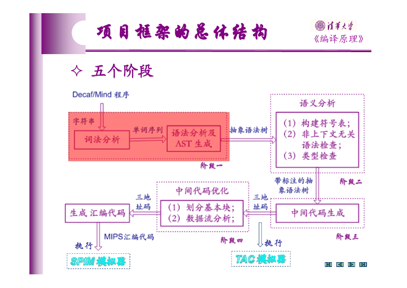

# PA1-A: 词法分析、语法分析和抽象语法树生成

## 任务概述

在本阶段中，大家的任务是编码实现 Decaf 语言编译器的词法分析和语法分析部分，同时生成抽象语法树。



首先是**词法分析** (lexical analysis)。
你需要运用“词法分析程序自动构造工具” (lexer generator) 生成 Decaf 语言的“词法分析程序” (lexer/scanner)。
词法分析程序是前端分析的第一部分，它的功能是从左至右扫描 Decaf 源语言程序，
识别出标识符、关键字、整数常量、操作符等各种单词符号，并把识别结果以单词 (token) 的形式返回给语法分析程序。
这一部分的实验目的是要掌握自动工具的用法，体会正规表达式、有限自动机等理论的应用，并对词法分析程序的工作机制有比较深入的理解。

之后是**语法分析** (parsing)。
你需要运用“语法分析程序自动构造工具” (parser generator) 生成 Decaf 语言的“语法分析程序” (parser)，并最终生成抽象语法树。
这一部分的实验目的是要掌握自动工具工具的用法，体会上下文无关文法、LALR(1) 或 LL(*) 分析等理论在编译器构造中的实际应用。

PA1-A 的两部分是密切相关的：语法分析程序并不直接对 Decaf 源程序进行处理，而是调用词法分析程序对 Decaf 源程序进行词法分析，
然后对词法分析程序返回的终结符序列进行归约，也就是说，词法分析程序输出的结果才是语法分析的输入。

当语法分析程序运行结束，如果没有发现语法错误，PA1-A 会生成与 Decaf 源程序对应的抽象语法树。这就是 PA1-A 的最终产物。

PA1-A 是整个实验的热身阶段，需要自己完成的代码量较少，主要的工作在于建立编程环境、熟悉代码框架、熟悉 Decaf 语言以及掌握自动工具的具体用法等。
不熟悉 Git 的同学，请在这一阶段逐渐掌握 Git 的基本使用，包括 clone/pull/commit/push 等入门功能，
以保证在截止日前前你能将代码提交到指定仓库的 master 分支上。

本阶段的测试方法是：编译器格式化输出抽象语法树，测试程序比较其与标准输出是否完全一致。
我们保留了一些测试例子没有公开，所以请自己再编写一些测例，以更加充分地测试你的实现是否符合新特性的规范。

## 相关知识

### First-class Functions

函数式 (functional) 语言的一个显著特征是，函数是“一等公民” (first-class citizens)，即函数能像普通的值（如整数、字符串、对象等）一样，
作为函数调用的参数和返回值进行传递。
Lambda 表达式提供了一种不用取名字就能直接定义出来一个函数的方法。它是所有函数式语言（如 Haskell/Ocaml/Scala）的标配。
很多不以函数式作为典型语言特征的语言，如 C#、Rust、C++ 甚至 Java 都开始支持 lambda 表达式。

老版本的 Java 不支持 lambda 表达式，为了实现整数到布尔值的函数类型，我们不得不通过接口来定义：

```java
interface IntPredicate { boolean judge(int x); }

class Main {
    static IntPredicate not_eq(int y) {
        return new IntPredicate() {
            public boolean judge(int x) { return x != y; }
        };
    }

    static IntPredicate eq(int y) {
        return new IntPredicate() {
            public boolean judge(int x) { return x == y; }
        };
    }

    static void check(String msg, IntPredicate p, int x) {
        System.out.println(msg + p.judge(x));
    }

    public static void main(String[] args) {
        check("3 != 3 is ", not_eq(3), 3);  // false
        check("3 != 4 is ", not_eq(3), 4);  // true
        check("3 == 3 is ", eq(3), 3);      // true
        check("3 == 4 is ", eq(3), 4);      // false
    }
}
```

虽然新版的 Java 支持了 lambda 表达式，但它本质上还是会对应到接口 `Function`/`Consumer`/`Supplier` 等。
因此在实际使用中，Java 的函数式特性比普通函数式语言要不方便得多。

Lambda 表达式能你的程序更可读、更可维护、更健壮。比较下面的 C 代码

```c
int l = 0;
for (int i = 0; i < n; i++) {
    if (a[i] % 2 == 0) continue;
    b[l++] = a[i] * 3;
}
```

和 Haskell 代码

```haskell
let odd x = x `mod` 2 /= 0
in  map (*3) $ filter odd a
```

后者更可读，更精准的传达了程序员的意图：“先去掉偶数，然后乘三”。

### 抽象语法树

所谓**抽象语法树** (Abstract Syntax Tree, AST)，是指一种只跟我们关心的内容有关的语法树表示形式。
抽象语法是相对于具体语法而言的，所谓具体语法是指针对字符串形式的语法规则，而且这样的语法规则没有二义性，适合于指导语法分析过程。
抽象语法树是一种非常接近源代码的中间表示，它的特点是：

1. 不含我们不关心的终结符，例如逗号等（实际上只含标识符、常量等终结符）。
2. 不具体体现语法分析的细节步骤，例如对于 `List ::= List Elem | Elem` 这样的规则，
按照语法分析的细节步骤来记录的话应该是一棵二叉树，但是在抽象语法树中我们
只需要表示成一个列表，这样更便于后续处理。
3. 可能在结构上含有二义性，例如加法表达式在抽象语法中可能是 `Expr -> Expr + Expr`，
但是这种二义性对抽象语法树而言是无害的——因为这种二义性已经在语法分析阶段解决了。
4. 体现源程序的语法结构，尤其是树形结构。

使用抽象语法树表示程序的最大好处是把语法分析结果保存下来，后面可以反复利用。
在面向对象的语言中描述抽象语法树是非常简单的：我们只需要为每种非终结符创建一个类。

在我们的代码框架中我们已经为你定义好各种符号在 AST 中对应的数据结构。请在实验开始前阅读相关代码。

### EBNF

使用最朴素的 BNF (Backus–Naur Form)，Decaf 语言的一个文法片段描述如下：

```text
topLevel        ::= classList
classList       ::= classList classDef | classDef
classDef        ::= 'class' id extendsClause '{' fieldList '}'
extendsClause   ::= 'extends' id | ε
fieldList       ::= fieldList varDef ';' | fieldList methodDef | ε
```

表示的是

- 一个 `topLevel` 有至少一个 `classDef`。
- 一个 `classDef` 首先是关键字 `class`，跟上`id`，然后是一个可选的 `extendsClause`，最后是大括号包起来的零个或多个成员定义。

我们可以写成如下 EBNF (Extended Backus–Naur Form)，更精确和简明地反映上述含义：

```text
topLevel    ::= classDef+
classDef    ::= 'class' id ('extends' id)? '{' fieldDef* '}'
fieldDef    ::= varDef ';' | methodDef
```

在 EBNF 中，各符号（或者符号串）允许添加如下拓展标记：

- `+`：在它前面的符号（或者符号串）出现一次或者多次
- `*`：在它前面的符号（或者符号串）出现零次或者多次
- `?`：在它前面的符号（或者符号串）出现零次或者一次
- `(` `)`：分组
- `|`：选择，原来也有，但允许选择出现在分组里。例：`s ::= ('a' | 'b') 'c'` 等价于 `s ::= 'a' 'c' | 'b' 'c'`

加入这些拓展可以有效简化语法。作为一个例子，Scala 版本使用的 Antlr4 就支持这些拓展。
现在 [Antlr4 的文法描述文件](https://github.com/decaf-lang/decaf-in-scala/blob/master/src/main/antlr4/DecafParser.g4)的语法部分只有 80 行，
而 Jacc 版本有 126 行，多了 50% 以上。
> 备注：语法测量去除了文件头、语法动作、注释、空行，Scala 文法文件被改写成和 Java 版本一样的风格，2019 年 9 月 27 日测量。

所以，后面我们会使用 EBNF 来描述文法。
另外的好处是，这样能够防止你们直接抄实验指导书。

## 实验内容

本次实验给出了基础的 Decaf 框架，它完成了[《Decaf语言规范》](https://decaf-lang.gitbook.io/workspace/spec)。
本次实验你的任务是，在这个框架的基础上，完成新特性的词法语法分析。

以下给出各新特性对应的语法规范。注意：这是规范而不是实现，你的实现应当符合此规范。

### 新特性 1：抽象类

加入 `abstract` 关键字，用来修饰类和成员函数。例如，

```decaf
abstract class Abstract {
    abstract void abstractMethod();
}
```

语法规范：将原来的

```text
classDef ::= 'class' id  ('extends' id)?  '{' field* '}'
methodDef ::= 'static'? type id '(' paramList ')' block
```

变成

```text
classDef ::= 'abstract'? 'class' id  ('extends' id)?  '{' field* '}'
methodDef ::= 'static'? type id '(' paramList ')' block
            | 'abstract' type id '(' paramList ')' ';'
```

### 新特性 2：局部类型推断

加入 `var` 关键字，用来修饰**局部变量**。例如

```decaf
class Main {
    static void main() {
        // int i = 0;
        var i = 0; // identical as above
    }
}
```

语法规范：

```text
simpleStmt ::= ...
             | 'var' id '=' expr
```

### 新特性 3：First-class Functions

这是本学期新特性中最复杂的一部分。幸运的是，在 PA1-A 中你只需考虑词法和语法分析的问题。
具体地，你需要支持以下三种新语法：

#### 函数类型

语法规范：

```text
type ::= ...
       | type '(' typeList ')'

typeList ::= (type (',' type)*)?
```

括号左边的是返回值的类型，括号内的是诸参数的类型。

#### Lambda 表达式

有两种, block lambda 和 expression lambda。Lambda 表达式的类型是函数类型。

语法规范：

```text
expr ::= ...
       | 'fun' '(' paramList ')' '=>' expr
       | 'fun' '(' paramList ')' block

paramList ::= (type id (',' type id)*)?
```

其中新增的箭头操作符 `'=>'` 左边是参数列表，右边是返回值。`'=>'` 的优先级最低。
`fun` 为新增的关键字。
Block lambda 可以包含 return 语句表示返回值（当然，没有 return 语句的话返回类型是 void）。

#### 函数调用

原来只能调用成员方法和静态方法，现在可以调用任意类型为函数类型的表达式（其本质就是个函数）。

语法规范：将原来的

```text
call ::= (expr '.')? id '(' exprList ')'
```

变为

```text
call ::= expr '(' exprList ')'
```

#### 补充：Lambda 表达式的例子

对部分同学，lambda 表达式还是个新东西。所以下面是一些例子，帮助你理解。

函数类型：

```decaf
void()               // 没有参数，返回类型 void

int(int)             // 接受一个 int 类型的参数，返回 int

string(int, int)     // 接受两个 int 类型的参数，返回 string

class Main(int, int) // 接受两个 int 类型的参数，返回 Main 的一个实例

int(int(int))        // 参数是一个 int 到 int 的函数，返回值是 int

int(int)(int)        // 参数是一个 int，返回一个 int 到 int 的函数（注意这里的返回值也是一个函数）
```

Lambda 表达式：

```decaf
fun (int x) => x + 1            // 类型是 int(int)

fun (int x, int y) => x + y     // 类型是 int(int, int)

fun (int x) { if (x == 0) return "no"; return "yes"; }   // 类型是 string(int)

fun (int x) => fun (int y) => x + y
// 类型是 (int(int))(int)
// 上面一个函数是所谓 curry function 的例子。其实它就是 x+y，但是它不要求你把两个参数一次性都提供了。
// 而是先接受第一个参数 x，然后返回一个函数。被返回的函数还能接受参数 y。
// 比如这个函数接受参数 x=2 之后，返回一个函数 (int y) => 2 + y。
// 这个被返回的函数再接受 y=3，返回最终结果 2+3=5。

fun (int(int) f, int[] arr) { for (int i = 0; i < arr.length(); i = i + 1) arr[i] = f(arr[i]); }
// 类型是 void(int(int), int[])
// 前面的例子是返回值为 lambda 的情况，这个例子是 lambda 作为参数的情况
// 函数的意思很明显，不用解释了
```

函数调用：

```decaf
var f = fun (int x) => fun (int y) => x + y; // f 的类型是 int(int)(int)
Print(f(2)(3));  // 输出 5。这里有两次函数调用（不含 Print）
```

> 一个小故事：
>
> 我们采用 C / C++ 风格来写函数类型。你可能觉得这种写法很怪。这样设计主要是为了让 PA1-B 阶段更容易。
> 还有更怪的：C 中声明一个函数指针 `a` 要写成 `int (*a)(int, int);`
> 但是，你可以认为这样的类型写法指明的是 “我们应该如何使用这个类型的变量”
> 比如上面的 `a`，它的用法是 `int b = (*a)(4, 5)` -- 和签名太像了。
> 也许这也能帮助你理解，为什么 C 和 C++ 数组声明是 `int a[10]` 而不是 `int[10] a`，
> 以及为什么有些人写 `char *a` 而不是 `char* a`。

### AST 格式化打印

在 PA1-A 阶段，我们最终会将你构造出来的 AST 进行格式化打印，并与标准输出比对是否一致。
所有 AST 结点的打印格式都遵循如下流程：

1. 打印结点名称和位置
2. 增加缩进
3. 遍历所有元素（子树），依次递归打印它们
4. 减少缩进

新增特性的打印格式如下：

#### 抽象类/方法

打印抽象类/方法时，其修饰符 `abstract` 打印为 `ABSTRACT`。如

```decaf
abstract void foo();
```

对应的 AST 打印为（省略了位置，下同）

```text
MethodDef @ ...
    ABSTRACT
    foo
    TVoid @ ...
    List
        <empty>
    <none>
```

#### `var` 局部变量定义

打印用 `var` 修饰的局部变量定义时，按照标准的 `LocalVarDef` 来打印，只不过将其第一个元素（类型）打印为空 `<none>`。如

```decaf
var a = 5;
```

对应的 AST 打印为

```text
LocalVarDef @ ...
    <none>
    a
    IntLit @ ...
        5
```

#### 函数类型

结点名称为 `TLambda`。包含两个元素：第一个元素是返回值类型。第二个元素一个类型的列表，分别表示其参数类型。如

```decaf
void(int, int)
```

对应的 AST 打印为

```text
TLambda @ ...
    TVoid @ ...
    List
        TInt @ ...
        TInt @ ...
```

#### Lambda 表达式

结点名称为 `Lambda`。包含两个元素：第一个元素是参数列表，各参数按照 `LocalVarDef` 来打印。
第二个元素是返回值，它可能是一个表达式，也可能是一个语句块。如

```decaf
fun (int x) => x + 1
```

对应的 AST 打印为

```text
Lambda @ ...
    List
        LocalVarDef @ ...
            TInt @ ...
            x
            <none>
    Binary @ ...
        ADD
        VarSel @ ...
            <none>
            x
        IntLit @ ...
            1
```

#### 函数调用

结点名称为 `Call`。包含两个元素：第一个元素是一个表达式，代表要调用的函数。
第二个元素是表达式的列表，代表调用参数。如

```decaf
apply(f, 12)
```
对应的 AST 打印为

```text
Call @ ...
    VarSel @ ...
        <none>
        apply
    List
        VarSel @ ...
            <none>
            f
        IntLit @ ...
            12
```

测例中给出了更多标准输出作为例子。
在实验开始前，建议你阅读所使用框架的实验指导书，搞清楚框架是如何定义各 AST 结点，并完成格式化打印的。

## 实验评分和实验报告

实验评分分两部分：

- 评测结果：80%。这部分是机器检查，要求你的输出和标准输出**一模一样**。我们会有**未公开**的测例。
- 实验报告（根目录下 `report-PA1-A.pdf` 文件）：20%。要求用中文简要叙述你的工作内容。此外，请在报告中回答以下问题：

Q1. 请根据你选择的实验框架回答不同的问题：

(Java & Scala) AST 结点间是有继承关系的。若结点 `A` 继承了 `B`，那么语法上会不会 `A` 和 `B` 有什么关系？限用 100 字符内一句话说明。

(Rust) 有一部分 AST 结点是枚举类型。若结点 `B` 是枚举类型，结点 `A` 是它的一个 variant，那么语法上会不会 `A` 和 `B` 有什么关系？限用 100 字符内一句话说明。

Q2. 原有框架是如何解决空悬 else (dangling-else) 问题的？限用 100 字符内说明。

Q3. PA1-A 在概念上，如下图所示：

```text
作为输入的程序（字符串）
    --> lexer --> 单词流 (token stream)
    --> parser --> 具体语法树 (CST)
    --> 一通操作 --> 抽象语法树 (AST)
```

输入程序 lex 完得到一个终结符序列，然后构建出具体语法树，最后从具体语法树构建抽象语法树。
这个概念模型与框架的实现有什么区别？我们的具体语法树在哪里？限用 120 字符内说明。
