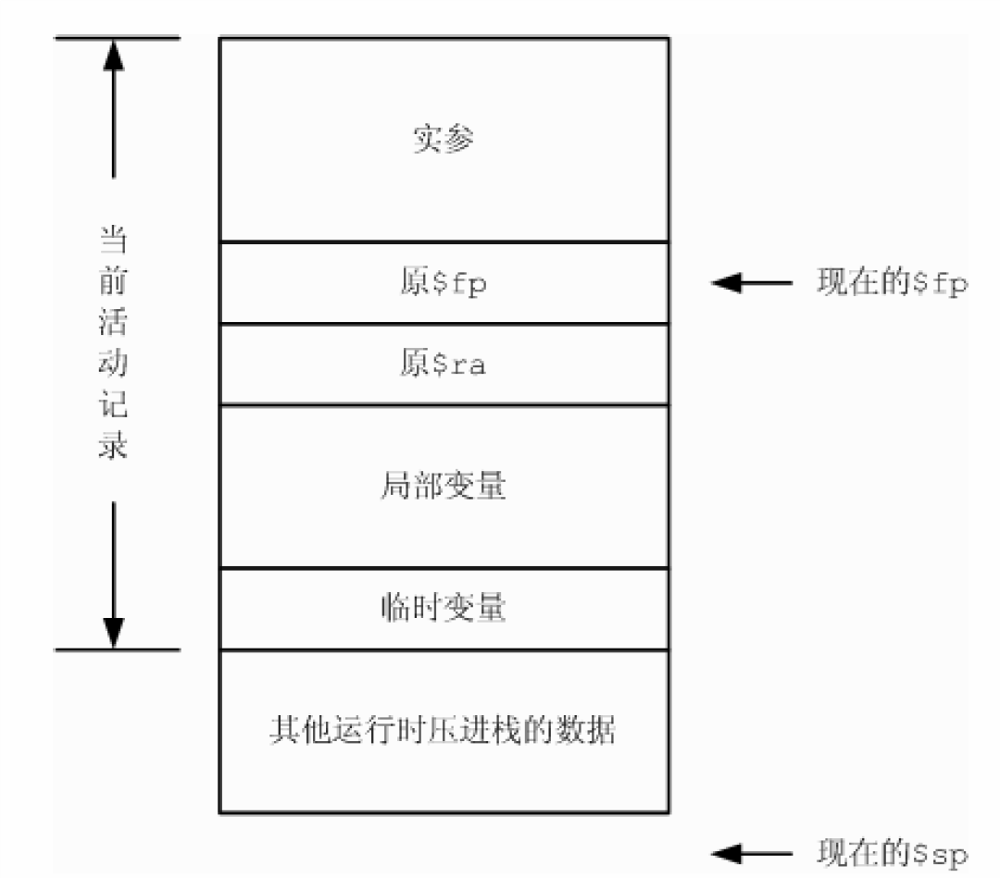
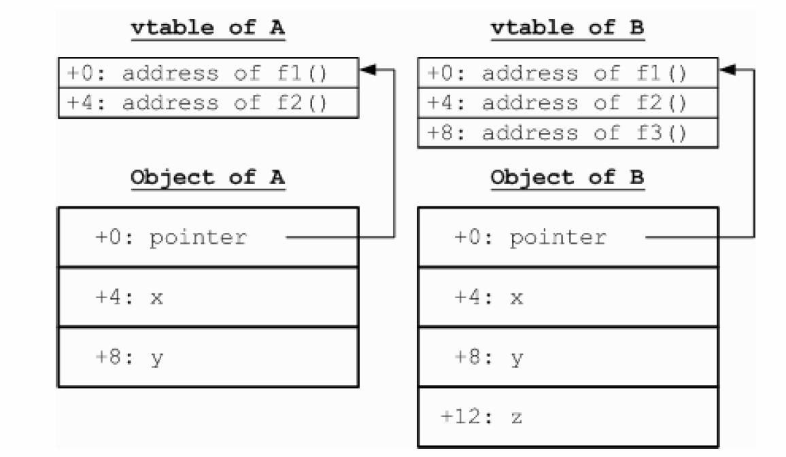

# PA3: 中间代码生成

## 任务概述

本阶段，我们将对该输入程序进行翻译，把使用带属性修饰的抽象语法树（decorated AST）来表示的输入程序翻译成适合后期处理的另一种中间表示方式。这种中间表示叫做三地址码（Three Address Code, TAC），是一种比较接近汇编语言的中间表示。

## 实验内容

本次实验将给出 decaf 基本框架，其中已经完成了[《Decaf 语言规范》](https://decaf-lang.gitbook.io/workspace/spec) 中所描述语言特征的词法、语法及语义分析。要求和前几阶段一样，增加新语言特性的实现，对AST进行扫描，完成相应语句和表达式的翻译工作。开始时，你需要将前面阶段的工作复制到本次实验的框架中。建议你首先要充分理解基本框架的代码结构及功能，参考框架中对相似语言特征的处理过程，根据自己对语言的理解完成新增语言特性的TAC代码生成。

<!-- 基本框架的实验指导参见：

* [Java](https://decaf-lang.gitbook.io/decaf-book/java-kuang-jia-fen-jie-duan-zhi-dao/pa2-yu-yi-fen-xi)
* [Scala](https://decaf-lang.gitbook.io/decaf-book/scala-kuang-jia-fen-jie-duan-zhi-dao/pa2-yu-yi-fen-xi)
* [Rust](https://decaf-lang.gitbook.io/decaf-book/rust-kuang-jia-fen-jie-duan-zhi-dao/pa2-yu-yi-fen-xi) (这个文档不一定是最新的，建议使用[这个文档](https://mashplant.gitbook.io/decaf-doc/pa2/shi-yan-nei-rong)) -->


### 合并前一阶段的工作

如果你做 PA2 时直接在框架整体上开发，你需要先找出最新版框架与上一版框架的差异，合并到你的代码，然后继续迭代开发(如果你是用 `git clone` 的只需 `git pull` 就行了)。

如果你做 PA2 时没有直接在框架整体上开发，而使用了只包含 PA2 的框架，你可以使用两种方法升级你的代码：

1. 找出 PA3 单独框架相对于 PA2 单独框架的差异，将修改应用于你的代码
2. 找出你的代码与 PA2 单独框架的差异，将修改应用于 PA3 单独框架

关于“找出两版本代码之间的差异，合并到另一处代码”这件事，有许多工具可以自动化完成。首先需要制作一些补丁文件，我们已经提供了“PA3 单独框架相对于 PA2 单独框架的差异”与“最新版框架相对于上一版框架的差异”两种补丁文件，而对于“你的代码与 PA2 单独框架的差异”，你可以使用 `git diff` 自行制作补丁。然后可以使用 `git apply` / `patch` 等工具自动完成打补丁操作：

```bash
cd your_project
git apply path/to/your/patches/*.patch
```

```bash
cd your_project
patch -p1 < path/to/your/patches/*.patch
```

如果打补丁过程中遇到无法自动处理的冲突，则需要手动处理。

### 新特性 0：动态错误检查

本阶段还要求检测另一种运行时错误：“除零”非法。可参考框架中的两种关于数组的运行时错误检测：数组下标越界和数组大小非法。当出现“除零”或者“对0求mod”问题时，进行报错。例如：

```java
class Main {   
    static void main() {
        int a;
        a = 13%0;               
        Print("end");       
    }
}
```

期望的输出是：

```
Decaf runtime error: Division by zero error
```

> 提示：选择Rust版本的同学需要做一点额外的处理来规避tacvm的错误检查，参考[这里](https://mashplant.gitbook.io/decaf-doc/pa3/tacvm-jie-shao#cuo-wu-jian-ce)

### 新特性 1：抽象类

支持用 `abstract` 关键字定义抽象类，及修饰其中的抽象成员方法。抽象类不会对虚表产生影响，因此，关于此特性只需要确定不要尝试遍历抽象函数的函数体。


### 新特性 2：局部类型推导

加入 `var` 关键字，支持编译器进行局部变量的类型推导。由于本阶段局部变量的类型已经被推导出来了，故变量定义的逻辑与框架中`LocalVarDef`完全相同，不需要进行额外处理。

### 新特性 3：First-class Functions

这是本学期新特性中最复杂的一部分。这里对第三个特性（First-class functions）的实现给出一定的指导，顺序基本上是由易到难。

我们会给出一些Decaf代码翻译到TAC代码的例子，因为只是作说明用途，所以Decaf代码和TAC代码都不一定完全符合语法规范。

#### 扩展 call

你可以区分对于普通方法和其它的所有调用，普通方法的调用基本框架已经实现，而其它的所有调用，无非只有Lambda表达式和由方法名生成的函数对象两种，如果你对这二者保持类似的内存布局，就可以统一这两种调用。

具体来说，我们推荐的实现方式是：

1. 这两种函数对象都是分配在堆上的(即通过`_Alloc`函数申请内存而构造的)，**它们的偏移量0处，都存储着一个函数指针**（这就是"保持类似的内存布局"的含义）。
2. 当检测到并非方法调用（例如Java版框架是`!call.symbol.isMethodSymbol()`)时，证明是这两种函数对象，把它的偏移量0处的值取出来，并且把它自身作为第一个参数，再传入后续参数，再调用刚才取出来的函数指针。

例子：

```java
static int foo(int(int, int) f) {
    return f(1, 2);
}
```

翻译为：

```
_T1 = *(_T0 + 0) # _T0是f
parm _T0
parm 1
parm 2
_T2 = call _T1
return _T2
```

#### 将方法名直接当做函数使用

值得注意的是，被调用的函数应该是动态分发的，即调用的具体方法应该是由对象的运行时类型而非编译时类型决定的（大家在学习OOP的时候应该对这两个概念有所了解），例如：

```java
class A {
    void() getf() { return f; }
    void f() { Print("A"); }
}

class B extends A {
    void f() { Print("B") }
}

class Main {
    static void main() { 
        class A b = new B();
        b.getf()(); 
    }
}
```

期望的输出是：

```
B
```

具体实现时，需要分三种情况：非`static`方法，`static`方法，数组长度（**为减轻大家的工作量，PA3不考察这种情况**）。下面按照这个顺序依次讲解，其中第一种是最复杂的，理解了它的实现之后其他两种都很容易实现。

非`static`方法的情况：

1. 新生成一个函数，内容是：将第一个参数（回忆上一节，这个函数的参数值分别都是什么？）的偏移量4处的值取出来，它是对象指针，把它传参（`param`指令），再将后续的所有参数依次传参（参数数量根据方法的类型决定）。然后根据正常的虚函数调用的方式调用这个方法，并且将这个方法的返回值（如果有的话）返回。
2. 申请8个字节的内存，偏移量0处存储函数指针，偏移量4处存储对象指针。它就是你需要的函数对象。

> 怎样获取函数指针呢？Rust框架采用的TAC模拟器支持一条`LoadFunc`指令，可以直接获取；Java/Scala框架采用的TAC模拟器则不支持，可以新生成一个虚表，然后间接地获取函数指针。

`static`方法的情况：

1. 新生成一个函数，内容是：将除了第一个参数之外的所有参数依次传参（参数数量根据方法的类型决定）。然后根据正常的非虚函数调用的方式调用这个方法，并且将这个方法的返回值（如果有的话）返回。
2. 申请4个字节的内存，偏移量0处存储函数指针。它就是你需要的函数对象。

数组长度的情况（**PA3不考察这种情况**）：

1. 新生成一个函数，内容是：将第一个参数的偏移量4处的值取出来并返回之。
2. 申请8个字节的内存，偏移量0处存储函数指针，偏移量4处存储数组长度，这个数组长度就是用正常的计算数组长度的方法得到的。它就是你需要的函数对象。

例子：

```java
class A {
    int(int) getf() { return f; }
    int f(int a) { return a + 1; }
}
```

`getf`翻译为：

```
parm 8
_T1 = call _Alloc
_T2 = 设法获取函数指针
*(_T1 + 0) = _T2
*(_T1 + 4) = _T0 # _T0是this
return _T1
```

新函数翻译为：

```
_T2 = *(_T0 + 4) # _T0是函数对象，_T2是其中存储的对象指针
_T3 = 利用_T2获取虚函数地址
parm _T2
parm _T1 # _T1是第一个参数
_T4 = call _T3
return _T4
```

这个新函数的名字可以随意起，只要自己的起名方案能够保证最后不会重复就行了。

#### Lambda表达式

现在看来，为了大家能够更好地在PA3实现Lambda表达式，本应该要求大家在PA2中输出所有被Lambda表达式捕获的变量，但是当时负责PA2的助教没有想到这一层，这是我们的一个失误。当然，这也许在一定程度上降低了PA2的难度。

PA3需要精确地知道Lambda表达式捕获了哪些变量，为了获取这个信息，需要注意以下几点：

1. 被捕获的变量一定是**没有owner**的，例如Lambda表达式访问了`a.b.c`（有可能是读或者写），不捕获`b`和`c`，只捕获`a`
2. 由1可知，被捕获的变量要么是局部变量，要么是`this`中的field，**要么是`this`**。后两种情形中，都需要捕获`this`。
3. 在Lambda表达式1内部定义的Lambda表达式2如果捕获了一个变量，如果这个变量不是**由1定义的局部变量**（即1的LambdaScope中的变量或者1的Block中的LocalScope中的变量），那么1也必须捕获这个变量。为了实现这一逻辑，我们推荐在类型检查的代码中保存一个Lambda表达式栈，如果你在PA2不是这样实现的，建议做出一定修改。

为了生成Lambda表达式，申请`(1 + 被捕获的变量数目) * 4`个字节的内存，偏移量0处存储函数指针，后续按照一定的顺序存储每个被捕获的变量，我们并不要求特定的顺序，只要你自己的代码保持一致即可。函数指针和上一节类似，也是指向一个新生成的函数，这个函数的内容就比较显然了。

此外，你需要修改当前框架中对于`VarSel`和`This`的处理，如果发现当前是在Lambda表达式内部（你需要保存相关的信息来判断当前是在哪个Lambda表达式内部），而且这个变量的确被捕获了，那么需要把对应的**读**操作修改成对当前函数的第一个参数的对应偏移量的访存。

>  不可能遇到对于被捕获变量的写操作。想一想为什么？

例子：

```java
class A {
    int field;
    
    int(int) getf(int local) {
        return fun(int x) { // 捕获this, "local"
            fun() => local; // 捕获 "local"
            return field + x;
        };
    }
}
```

`getf`翻译为：

```
parm 12
_T2 = call _Alloc
_T3 = 设法获取函数指针(外层的Lambda对应的)
*(_T2 + 0) = _T3
*(_T2 + 4) = _T1 # _T1是"local"
*(_T2 + 8) = _T0 # _T0是this
return _T2
```

外层的Lambda表达式对应的函数为：

```
parm 8
_T2 = call _Alloc
_T3 = 设法获取函数指针(内层的Lambda对应的)
*(_T2 + 0) = _T3
_T4 = *(_T0 + 4) # 读取捕获的"local"
*(_T2 + 4) = _T4 # 把捕获的"local"写入内层的Lambda对象，让它也捕获"local"
# 这时内层的Lambda对象已经构造好了，就是_T2，不过它没有被使用
_T5 = *(_T0 + 8) # 读取捕获的this
_T6 = *(_T5 + 4) # 读取this的"field"
_T7 = (_T6 + _T1) # field + x
return _T7
```

## 实验评分和实验报告

我们提供了若干测试程序和标准输出，你的输出需要与标准输出完全一致才行。我们还保留了一些未公开的测试例子，我们保证未公开的测例都是修改已有测例的整数常量后的结果，只要你没有使用非常规的特判，通过了所有公开测例后基本也能通过所有未公开测例。

实验评分分两部分：

- 评测结果：80%。这部分是机器检查，要求你的输出和标准输出**一模一样**。我们会有**未公开**的测例。
- 实验报告（根目录下 `report-PA3.pdf` 文件）：20%。要求用中文简要叙述你的工作内容。

此外，请在报告中描述lambda语法实现的流程，以及实现工程中遇到的困难。


## 相关知识

下面的这些内容在[Rust的实验框架介绍](https://mashplant.gitbook.io/decaf-doc/pa3)中基本都有涉及，不过它们并不是仅限选择Rust框架的同学阅读的，类似于"运行时存储布局"这样的知识点与框架其实没有什么关系，选择其他框架的同学也可以看一下Rust框架文档中的讲解。这两份文档的主要区别在于，这里的文档是祖传的，Rust的文档基本是今年助教新编写的。

### Decaf中的TAC简介

中间代码的目的是为了更好地对要翻译的内容进行加工处理，例如对代码进行优化等。中间代码的种类有多种，例如逆波兰表达式、三元式、TAC（三地址码，即四元式）、DAG（有向无环图）、类LISP表达式等等。不同的中间代码有不同的适用场合，例如有些适合进行代码逻辑分析，有些适合用来进行源语言层次的优化，有些适合用来做机器层次的优化等等，因此同一个编译器内可能会使用多种中间代码（源代码->中间代码1->中间代码2->…->目标代码）。在Decaf项目中我们只使用TAC作为我们的编译器中间代码，每条TAC最多可以有三个参数，例如加法指令中含有两个操作数地址和一个结果地址（所谓地址这里是指临时变量）。我们采用的是“源代码->AST->TAC->MIPS代码”的翻译过程。

我们在实验框架中的lowlevel/tac/TacInstr类下里面已经定义好了需要用到的所有的TAC种类（事实上你几乎不会直接使用它们，而是通过lowlevel/tac/FuncVisitor类的方法来创建TAC实例）。

下面这张表是Decaf中使用的TAC简介，更加详细的内容请参考框架代码及注释。
<table>
    <tr>
        <th>名字</th>
        <th>操作符</th>
        <th>显示形式示例</th>
        <th>含义</th>
    </tr>
    <tr>
        <th  colspan="4">赋值操作 </th>
    </tr>
    <tr>
        <th>Assign </th>
        <th> </th>
        <th>a = b </th>
        <th>把变量b的值赋给变量a </th>
    </tr>
    <tr>
        <th>LoadVTbl       </th>
        <th></th>
        <th>x = VTABLE\<C\></th>
        <th>把类C的虚表加载到x中 </th>
    </tr>
    <tr>
        <th>LoadImm4       </th>
        <th></th>
        <th>x = 34 </th>
        <th>加载整数常量到变量x中 </th>
    </tr>
    <tr>
        <th>LoadStrConst       </th>
        <th></th>
        <th>x = “Hello World” </th>
        <th>加载字符串常量到变量x中</th>
    </tr>
    <tr>
        <th  colspan="4">运算操作  </th>
    </tr>
    <tr>
        <th>Unary</th>
        <th>NEG</th>
        <th>c = - a </th>
        <th>把变量a的相反数赋给变量c </th>
    </tr>
    <tr>
        <th>Unary</th>
        <th>LNOT</th>
        <th>c = ! a </th>
        <th>把变量a逻辑非的结果放到c </th>
    </tr>
    <tr>
        <th>Binary  </th>
        <th>ADD</th>
        <th>c = (a + b) </th>
        <th>把a和b的和放到c中 </th>
    </tr>
    <tr>
        <th>Binary</th>
        <th>SUB</th>
        <th>c = (a - b)</th>
        <th>把a和b的差放到c中 </th>
    </tr>
    <tr>
        <th>Binary</th>
        <th>MUL</th>
        <th>c = (a * b) </th>
        <th>把a和b的积放到c中 </th>
    </tr>
    <tr>
        <th>Binary</th>
        <th>DIV</th>
        <th>c = (a / b) </th>
        <th>把a除以b的商放到c中</th>
    </tr>
    <tr>
        <th>Binary</th>
        <th>MOD</th>
        <th>c = (a % b) </th>
        <th>把a除以b的余数放到c中 </th>
    </tr>
    <tr>
        <th>Binary</th>
        <th>EQU</th>
        <th>c = (a == b)</th>
        <th>若a等于b则c为1，否则为0 </th>
    </tr>
    <tr>
        <th>Binary</th>
        <th>NEQ</th>
        <th>c = (a != b) </th>
        <th>若a不等于b则c为1，否则为0 </th>
    </tr>
    <tr>
        <th>Binary</th>
        <th>LES</th>
        <th>c = (a &lt; b) </th>
        <th>若a小于b则c为1，否则为0 </th>
    </tr>
    <tr>
        <th>Binary</th>
        <th>LEQ</th>
        <th>c = (a &lt;= b) </th>
        <th>若a小于等于b则c为1，否则为0 </th>
    </tr>
    <tr>
        <th>Binary</th>
        <th>GTR</th>
        <th>c = (a > b) </th>
        <th>若a大于b则c为1，否则为0 </th>
    </tr>
    <tr>
        <th>Binary</th>
        <th>GEQ</th>
        <th>c = (a >= b) </th>
        <th>若a大于等于b则c为1，否则为0 </th>
    </tr>
    <tr>
        <th>Binary</th>
        <th>LAND</th>
        <th>c = (a && b) </th>
        <th>把a和b逻辑与操作的结果放到c</th>
    </tr>
    <tr>
        <th>Binary</th>
        <th>LOR</th>
        <th>c = (a || b) </th>
        <th>把a和b逻辑或操作的结果放到c </th>
    </tr>
    <tr>
        <th  colspan="4">控制流管理  </th>
    </tr>
    <tr>
        <th>Branch</th>
        <th></th>
        <th>branch _L2 </th>
        <th>无条件跳转到行号_L2所表示的地址</th>
    </tr>
    <tr>
        <th>CondBranch </th>
        <th>BEQZ</th>
        <th>if (c == 0) branch _L1</th>
        <th>如果c为0则跳转到_L1所表示地址 </th>
    </tr>
    <tr>
        <th>CondBranch </th>
        <th>BNEZ</th>
        <th>if (c != 0) branch _L1</th>
        <th>如果c不为0则跳转到_L1所表示地址 </th>
    </tr>
    <tr>
        <th>Return</th>
        <th></th>
        <th>return c</th>
        <th>结束函数并把c的值作为返回值返回 </th>
    </tr>
    <tr>
        <th  colspan="4">函数调用相关操作  </th>
    </tr>
    <tr>
        <th>Parm</th>
        <<th></th>
        <th>parm a  </th>
        <th>变量a作为调用的参数传递</th>
    </tr>
    <tr>
        <th>IndirectCall </th>
        <th></th>
        <th>x = call a</th>
        <th>取出a中函数地址，并调用，结果放x </th>
    </tr>
    <tr>
        <th>DirectCall </th>
        <th></th>
        <th>x = call Label </th>
        <th>根据函数标签，调用函数，结果放x </th>
    </tr>
    <tr>
        <th  colspan="4">内存访问操作  </th>
    </tr>
    <tr>
        <th >Memory</th>
        <th>LOAD</th>
        <th>x = *(y - 4) </th>
        <th>把地址为y-4的单元的内容加载到x </th>
    </tr>
    <tr>
        <th >Memory</th>
        <th>STORE</th>
        <th>*(x + 4) = y </th>
        <th>把y保存到地址为x+4的内存单元中</th>
    </tr>
    <tr>
        <th  colspan="4">其他  </th>
    </tr>
    <tr>
        <th>Mark</th>
        <th></th>
        <th>_L5: </th>
        <th>定义一个行号_L5（全局的） </th>
    </tr>
    <tr>
        <th>Memo</th>
        <th></th>
        <th>memo 'XXX'</th>
        <th>注释：XXX（供模拟器使用） </th>
    </tr>
</table>

TAC表示中使用的数据对象如下

<table>
    <tr>
        <th>名字  </th>
        <th>含义 </th>
    </tr>
    <tr> 
        <th>Temp</th>
        <th>临时变量</th>
    </tr>
    <tr> 
        <th>Label </th>
        <th>标号</th>
    </tr>
    <tr> 
        <th>TacFunc</th>
        <th>函数块</th>
    </tr>
    <tr> 
        <th>VTable</th>
        <th>类的虚函数表</th>
    </tr>
</table>

其中Temp与实际机器中的寄存器相对应。在Decaf框架中，我们用临时变量来表示函数的形式参数（parameter/formal argument）以及函数的局部变量（但是不表示类的成员变量）。在PA3的AST扫描中，我们将会为所有函数的LocalVarDef时为其关联Temp对象。在后面的AST扫描过程中可以通过VarSymbol的temp变量来获得所关联的Temp对象。此外，在翻译的过程中还可以通过FuncVisitor的freshTemp()函数获取一个新的表示32位整数的临时变量。与实际寄存器不同的是，一个Decaf程序中可以使用的临时变量的个数是无限的。

Label表示标号，即代码序列中的特定位置（也称为“行号”）。在Decaf框架中有两种标号，一种是函数的入口标号，另一种是一般的跳转目标标号。正如我们在前面介绍，TAC是一种比较接近汇编语言的中间表示，因此诸如分支语句、循环语句等等将会转换成在一系列行号之中进行跳转的操作（即有些语言中的GOTO语句）。在PA3中，我们在扫描的时候为各Function对象创建TacFunc对象，其中就有函数的入口行号信息，在后面的AST扫描过程中可以用TacFunc的entry来获得函数的函数块然后得到入口行号对象。

Temp和Label都是用于函数体内的数据对象，在Decaf框架的TAC表示中，我们用TacFunc对象来表示源程序中的一个函数定义。与符号表中的Function对象不同，TacFunc对象并不包括函数的返回值、参数表等等信息，而仅仅包括了函数的入口标号以及函数体的语句序列。

VTable所表示的是一个类的虚函数表，即一个存放着各虚函数入口标号的数组。关于虚函数表的细节请参看后面的相应章节。

最后，一个VTable列表加上一个TacFunc列表，就组成了一个完整的TAC程序。

从上面对TAC中间表示的描述可以看出，该中间表示是一种比AST更低级、但比汇编代码高级的表示方式（具有“函数”、“虚函数表”等概念）。

在我们给出的Decaf代码框架中，已经为大家把创建各种TAC的方法封装成FuncVisitor类，大家需要利用该类建立各种数据对象、并且对函数体的各种语句和表达式进行翻译。需要注意的是，在开始翻译函数体之前需要调用FuncVisitor的构造函数来开始函数体的翻译过程，在翻译完函数体以后需要调用Translater的visitEnd ()函数来结束函数体的翻译过程（否则将不能形成正确的TacFunc对象）。

### Decaf提供的运行时库函数说明

一般来说，编译器在把源程序转换为目标机器的汇编程序或者机器代码的过程中，除了直接生成机器指令来实现一些功能以外，有时还会调用运行时库函数所提供的功能。所谓的运行时库（runtime library），是指一系列预先实现好的函数的集合（请注意跟Decaf语言规范中的“标准库函数”不同），这些函数往往是针对特定的运行平台实现的，帮助编程语言实现一些平台相关的功能，例如C语言中的libc库（在windows平台上通常是MSVCRT.dll），又例如Java语言的类库（例如rt.jar）等。通常，这样的运行库是随着所使用的编译器（或者解释器）的不同而不同的。

在Decaf中，为了实现一些平台相关的功能，我们也提供了一系列的运行时库函数，这些函数涉及到内存动态分配、输入输出等等功能。这些函数我们都定义在lowlevel.tac.Intrinsic中，通过DirectCall的方式来进行调用。注意库函数调用的传参方式和其他函数调用是一样的，也需要事先push参数。具体调用方法可以参考框架中给出的一些例子。

以下是对Decaf运行时库中所提供的八种运行时库函数的具体介绍：

##### Intrinsic.ALLOCATE
功能：分配内存，如果失败则自动退出程序

参数个数：1

参数1：为要分配的内存块大小（单位为字节）

返回：该内存块的首地址
##### Intrinsic.READ_LINE
功能：读取一行字符串（最大63个字符）

参数个数：0

返回：读到的字符串首地址
##### Intrinsic.READ_INT
功能：读取一个整数

参数个数：0

返回：读到的整数
##### Intrinsic.STRING_EQUAL
功能：比较两个字符串

参数个数：2

参数1，2：要比较的两个字符串的首地址

返回：若相等则返回true，否则返回false
##### Intrinsic.PRINT_INT
功能：打印一个整数

参数个数：1

参数1：要打印的数字

返回：无
##### Intrinsic.PRINT_STRING
功能：打印一个字符串

参数个数：1

参数1：要打印的字符串首地址

返回：无
##### Intrinsic. PRINT_BOOL
功能：打印一个布尔值

参数个数：1

参数1：要打印的布尔变量

返回：无
##### Intrinsic.HALT
功能：结束程序，可以作为子程序调用，也可以直接JUMP

参数个数：0

返回：无

### 运行时存储布局

一般来说，程序运行时的内存空间从逻辑上分为“代码区”和“数据区”两个主要部分。顾名思义，代码区用于存放可执行的代码，而数据区用于存放程序运行所需的数据（例如临时变量、虚函数表的空间等等）。

数据区按照所存放的数据和对应的管理方法分为全局数据区（静态数据区）、栈区、堆区三部分，这三个区里面的存储空间分配分别遵循三种不同的规则：静态存储分配（Static Memory Allocation）、栈式存储分配（Stack-based Allocation）和堆式存储分配（Heap-based Allocation），其中后两种分配方式称为“动态存储分配”，因为这两种方式中存储空间并不是在编译的时候静态分配好的，而是在运行时才进行的。
#### 全局数据区（静态数据区）
全局/静态数据区用于存放各种全局变量、静态变量还有类的虚函数表。静态存储分配的结果是编译的时候确定的，在进行编译的时候编译器根据全局变量等信息事先计算好所需的存储空间以及各变量在这个存储空间中的偏移地址。在C语言中全局数组的存储分配方法即为静态存储分配。
静态存储分配并不是总适用的，对于一些动态的数据结构，例如动态数组（C++中使用new关键字来分配内存）以及可重入函数的局部变量（例如Hanoi Tower问题中递归函数的局部变量）等最终空间大小必须在运行时才能确定的场合静态存储分配通常无能为力。
#### 栈区
栈区顾名思义就是作为“栈”这样一种数据结构来使用的。栈区数据空间的存储管理方式称为栈式存储分配。与静态存储分配方式不同，栈式存储分配是动态的，也就是说必须是运行的时候才能确定分配结果的，比方说以下一个计算阶乘的C代码片断：


```java
int factorial (int n) { 
    int tmp; 
    if (n <= 1) 
        return 1; 
    else { 
        tmp = n – 1; 
        tmp = n * factorial(tmp); 
        return tmp; 
    } 
} 

```
这段代码中，随着n的不同，tmp变量所需要的总内存空间大小是不同的，而且每次递归的时候tmp对应的内存单元都不同。诸如局部变量的栈式存储分配方法想必大家在学习C++或者汇编语言的时候已经有所了解，函数调用时的存储布局情况，请参考后面章节。

分析函数调用时候的存储布局情况我们不难发现，进行栈式存储分配的条件是在编译的时候需要知道一个函数的活动记录有多大（以便在进入函数的时候动态地分配活动记录的空间），如果这点不能满足，则应该使用堆式存储管理。

一般来说，栈区中的数据通常都是函数的活动记录，活动记录中的数据通常是使用寄存器偏址寻址方式进行访问的。所谓寄存器偏址寻址方式，即在一个基地址寄存器中存放着活动记录的首地址，在访问活动记录某一项内容的时候只需要使用该首地址以及该项内容相对这个首地址的偏移量即可计算出要访问的内容在内存中的实际逻辑地址。这类数据包括了函数的形式参数以及局部变量，具体细节请参考后续章节。

#### 堆区

堆是栈以外的另一种动态存储分配结构，它有两个基本的操作：申请内存和释放内存，C++的new和delete两个关键字即对应这两种功能。关于堆式管理在学术界和工业界都进行了广泛的研究和探索，有兴趣的同学可以参考Wikipedia的这个页面：

http://en.wikipedia.org/wiki/Dynamic_memory_allocation

堆式管理是应用程序在运行的时候通过向操作系统请求分配内存（例如UNIX中使用sbrk系统函数）和释放内存来实现的，因此分配和销毁都要占用相当的时间。在Decaf里面，数组和类对象都是在堆区上来分配内存空间的（因此需要用ALLOCATE运行时库函数）。


### 一般函数调用过程

在这一节我们以C语言中的函数在MIPS机器上的调用过程为例（在x86上的过程类似），介绍一般函数的调用过程。对于C++中的虚函数以及Decaf中的函数，其调用过程略有不同，但基本的原理是相同的。
C语言程序一个典型的函数调用过程是这样的：

a) （调用方）把函数的实际参数按照参数表中从右到左的顺序压栈

b) （调用方）使用跳转语句跳转到函数入口（并把返回地址保存在$ra寄存器中）

c) （调用方或者被调用方）保存好返回地址

d) （被调用方）保存好原基地值寄存器$fp的值

e) （被调用方）把基地值寄存器$fp指向栈顶指针寄存器$sp所指的位置

f) （被调用方）修改栈顶指针寄存器的值$sp，使得$sp和$fp之间的区域足够存放函数的联系单元、局部变量和临时变量等

g) （被调用方）执行函数体代码直到函数返回

h) （被调用方）恢复原来的$sp和$fp

i) （被调用方）跳转回保存好的返回地址所指处

j) （调用方）释放之前压进栈的那些实参的空间（通过弹栈操作）

函数执行的时候的内存布局情况如图所示：




所谓活动记录（activity record），就是指当前函数执行所需的局部信息区域，这个区域包括了：传进函数的实参（在调用函数之前压进栈）、联系单元（动态链2和返回地址3）、函数的局部变量和各种临时变量，在诸如PL/0这样的支持函数嵌套定义的语言中，运行时联系单元中还会包括静态链信息。

在函数体中，访问函数的一个形式参数实际上是对实参区域进行访问，此时需要使用当前的基地值寄存器$fp加上该形参相对于当前栈帧首地址的偏移量进行访问，这是因为虽然在运行的时候存放着该形参内容的内存单元的地址在编译的时候是不可预先知道的，但是这个单元在活动记录中的位置在编译的时候是可以预知的。同样的访问方式也适合于对函数的局部变量以及临时变量的访问中。可见，在这种意义下，函数的参数、局部变量、临时变量三者并没有实质的区别，因此在Decaf代码框架中我们都使用Temp对象来表示这三种数据对象，其中唯一不同的是实参相对于当前栈帧首地址的偏移量是需要在PA3中预先算好的，而局部变量和临时变量的偏移量都是在PA4中进行数据流分析以后才确定（实际上可能使用寄存器就已经足够了，不需要偏量）。

在这次的decaf tac描述中，我们使用PARM来表示参数的传递，因此在TAC层实际上隐藏了实际的入栈操作，我们只需要按照从左到右的顺序传递参数即可。需要注意的地方是，TAC模拟器在执行时会将PARM传递的参数当做这个PARM之后第一次碰到的CALL的参数。


### 各种数据对象的内存表示

为了简单起见，我们在Decaf语言中不对浮点数进行支持。并且我们约定：

*   对于int类型的常量和变量，对应于32位整数，即4占字节

*   对于bool类型的常量和变量，使用32位整数实现（通常是用8位整数实现），以0表示false，1表示true

*   对于string类型的常量和变量，用字符串的首地址（32 位）的来表示字符串，字符串本身不记录长度，使用0字符（即'\0'）作为结束符，结束符不是字符串的一部分。这些都与C语言相同

*   对于数组，采用运行时动态分配的方式来分配存储空间，所分配到的存储区域大小为数组长度加1个单元，每个单元为32位（即4字节，以下同），其中第一个单元用于记录数组的长度（数组的length()函数用到这个信息），后面的单元均为数组内容，整个数组用指向第一个元素的指针（32位地址）表示

*   对于类对象，也是采用运行时动态分配的方式来进行存储空间分配，所分配到的区域应该包含以下内容：第一个单元存放着这个对象所对应的类的虚函数表地址（Virtual Table，请回忆C++中关于虚表的概念），这个单元的内容在调用一个类的成员函数的时候起着很重要的作用；后面的单元均用于存放与这个对象相关联的各个成员变量，存储位置越是靠近第一个单元，则该成员变量的“辈分”越高，例如三个类A、B、C有B继承于A而且C又继承于B的关系，这三个类分别有成员变量a、b、c，则对于一个类C的对象来说，a、b、c三者中存储位置最靠近第一个单元的应该是成员变量a，其次是b，离第一个单元最远的应该是c；类对象用指向对应存储区域第一个单元的指针来表示（更详细的说明请参考后面章节）

通过上述规定，在PA3中所有的数据类型都统一为用32位整数实现，任何一个变量或者常量都占用4字节。


### 面向对象机制的实现 

面向对象机制的重要特点是封装、继承和多态三方面，这三方面在Decaf语言中分别体现为：类和对象的机制、类的继承机制、成员函数的动态分发机制。这三种机制除了需要通过语义分析的帮助来实现以外，还需要在运行时存储布局、函数调用等方面来加以实现。其中类和对象的机制和类的继承机制涉及到对象的内存表示方式，成员函数的动态分发机制涉及到成员函数的调用方法，在成员函数中访问成员域涉及到this关键字的实现方法，我们在下面对这三部分内容分别进行简单的介绍（同时请回忆C++中面向对象机制的实现方法）。

#### 对象的内存表示及成员变量的访问方法

注:这一小节中有关虚表结构的是针对常规情形的一般性描述，实验框架中VTable的结构与此不同，请参考课堂上第十讲的内容。或者，[Rust框架文档](https://mashplant.gitbook.io/decaf-doc/pa3/mian-xiang-dui-xiang-ji-zhi)中描述的虚表与实际上各个框架中的虚表格式是一样的，也可供参考。

我们考虑如下类定义：


```java
class A { 
    int x; 
    int y; 
    int f1() {...} 
    int f2() {...} 
} 
class B extends A { 
    bool z; 
    int f3() {...} 
} 


```

我们知道，f1、f2、f3的地址都是存放在A或者B的虚函数表 中的，现在的问题是x、y、z是怎么存储的。由于不同的对象可以有不同的x、y和z的值，因此这些成员变量不能像成员函数那样存放在虚函数表中。一般来说这些域都存放在跟各对象相关联的内存块中，例如A的对象和B的对象的内存块的可能内容分别如图所示：



从图中可以看出，每一个对象实体都对应着一个记录这个对象状态的内存块，其中包括了这个对象的虚函数表指针和所有用于说明这个对象状态的成员变量。成员变量的排布顺序是：“辈分”越高的成员变量越靠前，例如从父类继承而来的成员变量总是在这个内存区域的前面，而子类特有的成员变量在这个内存区域的最后面，并且父类的成员变量的位置总是跟一个父类对象所对应的内存区域里面的情况一致的，这样做的目的是为了实现子类的对象能兼容于父类的对象（继承机制的一个表现）。

当访问一个对象的某个成员变量的时候，首先是通过这个对象的引用（在Decaf中引用通过指针实现，例如this）找到这块内存区域，然后再根据要访问的成员变量在这片内存区域中的偏移量对该成员变量进行访问的，由此可见，在Decaf中，访问一个对象的成员变量需要一次LOAD操作，而访问成员函数则由于需要通过首先按照访问成员变量的方式访问其虚函数表，然后在虚函数表中再次按照访问成员变量的方式拿到函数的入口指针，从而需要用两次LOAD操作。

#### this关键字的处理

在Decaf语言中，成员函数的函数体内可以使用this关键字来获得对当前对象的引用。此外，在成员函数的函数体中对成员变量或者成员函数的访问实际上都隐含着对this的访问。例如，在writeName的函数体内使用了this关键字，则执行who.writeName()的时候this所引用的对象和变量who所引用的对象是相同的，同样道理，如果执行you.writeName()的话则writeName里面的this将引用you所指的对象。可见，在不同的上下文中，调用writeName的时候this所引用的对象是不同的，也就是说不可能在编译的时候确定下来，那么在一般的C++、Java等语言中是怎么实现这个功能的呢？

这里有一个技巧就是把who或者you作为writeName的一个实际参数在调用writeName的时候传进去，这样我们就可以把对this的引用全部转化为对这个参数的引用。例如，当声明Father.writeName的时候，我们在参数表的开头悄悄地加入一个叫做this的隐含参数：

int writeName(class Father this) {...}

并且在调用writeName时，在传实参的时候把消息接收方表达式（即you或者who）的值传进去，即等价于这样的函数调用：

who.writeName() -> call writeName(who);

这样，我们只要把writeName函数体内所有对this关键字的引用都转化为对this隐含参数的引用即可。这个过程中必须小心注意的是this隐含参数的位置跟调用函数的时候的传参顺序要相对应。

实际上，我们在PA2进行visitVarSel的时候应当已经自动完成了this参数的添加操作(可见PA2中的setThis函数)，在PA3中我们只需要按照一般函数的调用方法来进行压参、求函数入口地址、调用即可(即this对应的临时变量为_T0)。

#### 虚函数表及成员方法的调用

虚函数表的目的是实现运行时函数地址绑定，即所谓的动态分发机制，例如以下Decaf代码：

```java
class Father { 
    int writeName() { print(1); ...} 
    int smile() { print(2); ...} 
} 
class Son extends Father { 
    int writeName() { print(3); } 
    int laugh() { print(4); } 
} 


```

这里Father类定义了一个writeName()方法，而其子类Son使用新的writeName()覆盖了这个方法。然后考虑以下的代码片断：

```java
class Father a; 
class Son b; 
class Father c; 
a = new Father(); 
b = new Son(); 
c = b; 
```

明显，执行a.writeName()的结果是输出1，执行b.writeName()的结果是输出3，但是执行c.writeName()的结果会是什么呢？虽然c被声明为Father的对象，但是实际上它是一个Son的对象，因此，按照Decaf语言规范，c.writeName()所调用的应当是Son的writeName()，即输出3（跟C++的虚函数特点是一样的）。

这种行为在二进制层次上是怎么实现的呢？这里我们将采用一种叫做“虚函数表”的结构。我们为每一个类都创建一个存放成员函数入口地址的数组如下：

```java
virtual table of Father: 
+0: address of function writeName (the version prints 1) 
+4: address of function smile 
vitural table of Son: 
+0: address of function writeName(the version prints 3) 
+4: address of function smile 
+8: address of function laugh 
```

上图中每个虚函数表中都列出其对应的类的所有可访问的成员函数地址，成员函数地址前面的+0、+4等等表示这个地址存放在虚表中的位置，例如+4表示存放在离虚表开头4字节的地方。然后我们在a和b所指向的内存区域的开头分别放有指向Father和Son的虚表的指针，在每次通过a或者b调用writeName()的时候，我们都首先通过a或b开头的那个虚表指针找到对应的虚函数表，然后在表中找出偏移地址为+0那一项对应的实际函数地址，调用之即可。

现在我们考虑c <- b的情况。由于Decaf的对象赋值采用引用赋值，因此这个赋值语句的效果仅仅是让c和b指向同一块内存区域。因此，按照上面的过程，当调用c.writeName()的时候，我们首先通过c所指向的内存区域找到对应的虚函数表（此时是Son的虚函数表），然后在这个虚函数表内找到writeName偏移量即+0对应的那一项。我们发现这一项对应的函数地址是打印3的那个writeName()函数的地址，因此c.writeName()的调用结果是输出3。

注意这里为了实现成员方法的继承，Son的虚函数表继承了Father的虚函数表中的smile那一项，并且为了保证子类兼容于父类，同名的函数在子类的虚表中的位置跟父类虚表中的位置是一样的，例如writeName和smile两个函数在Son虚表中处于+0和+4两个位置，这跟在Father的虚表中的情况一致；而原来Father中writeName的入口地址被Son版本的writeName的入口地址取代，以此实现成员函数的覆盖。

关于虚函数表的更多内容请参考：

http://en.wikipedia.org/wiki/Virtual_table

从上面关于虚函数表和成员方法的调用过程的介绍可以看出，Decaf中成员方法调用过程与一般C语言函数的调用过程不同之处仅在于通过虚函数表来查找函数入口地址以及加入了隐含的Decaf参数。

#### 静态方法的调用
静态方法类似C语言的函数，直接得到地址调用，不查询虚表。

