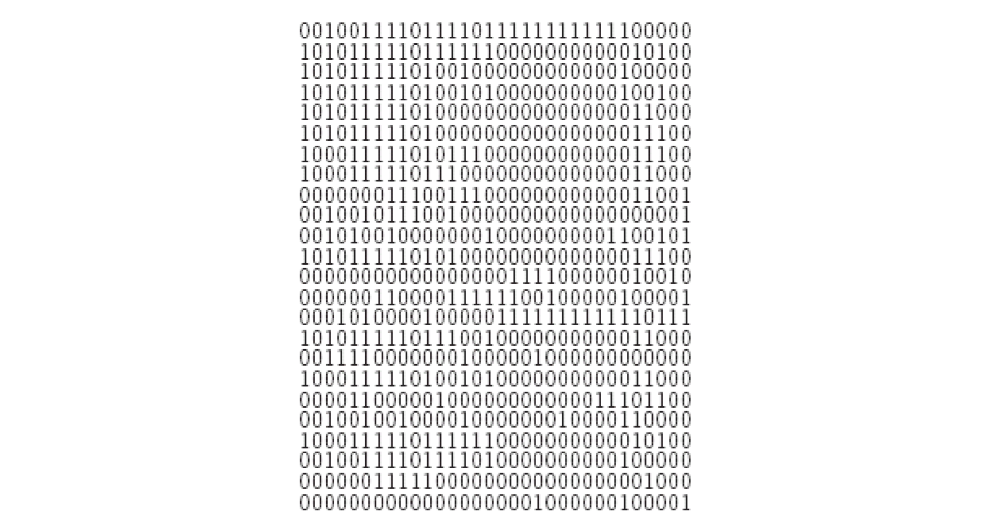
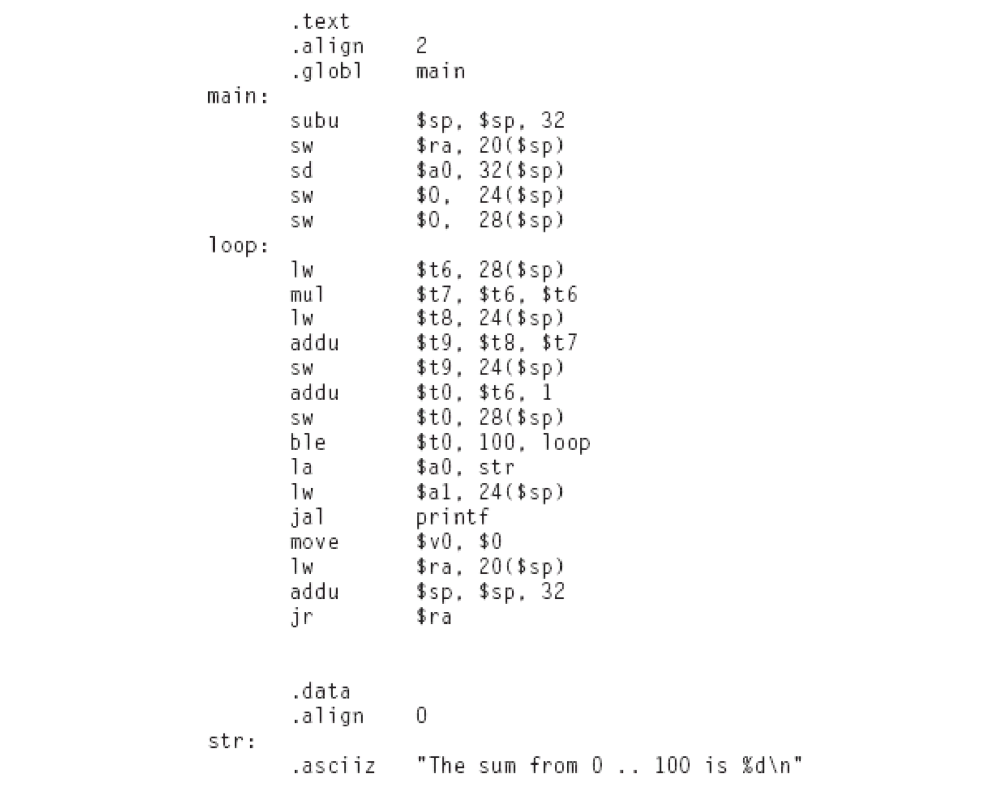
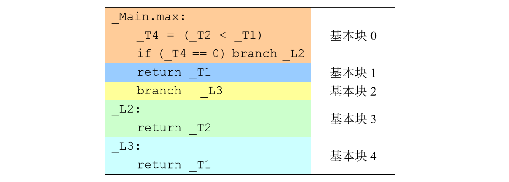
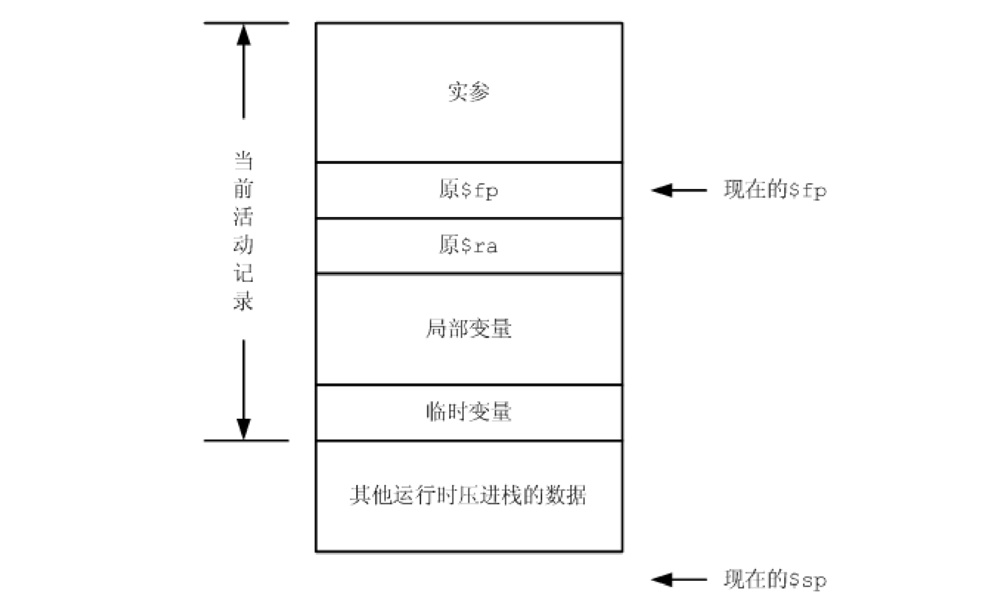

# PA4

中间代码优化

**注意：本阶段为选做。**

## 任务概述

本阶段，我们将进行一定程度的基于数据流分析的中间代码优化。本阶段的实验任务是**死代码消除**。
所谓死代码消除，是指无用代码消除，它与不可达代码消除是两个不同的概念。
前者指的是消除执行之后没有任何作用的代码，后者指的是消除永远无法被执行到的代码。
三种语言的框架中均包含了部分数据流分析的代码，你可以在此基础上实现死代码消除的算法。

此外，在Rust框架中还提供了其他三种优化的实现——公共表达式提取、常量传播和复写传播；而在Java/Scala框架中，上述优化均未实现。
因此，我们**鼓励**大家在完成死代码消除任务的基础上，还可以选择公共表达式提取、常量传播、复写传播或者其他你知道的优化进行实现，这将作为加分参考。

## 实验内容

本次实验的核心内容是在 Decaf 框架中实现死代码消除的优化，要求：

- 正确性：优化后的代码与优化前的代码语义上保持一致；
- 有效性：执行优化后的代码，所需的 TAC 指令总条数小于等于理论优化代码的指令条数。注意，如果“优化后比优化前的指令条数少”则可以得分，但仅仅当“优化后代码指令总条数小于等于理论优化代码的指令条数”时，可以视为完全实现优化。

由于 PA4 不会涉及任何本学期新增语言特性，我们允许你直接基于原始框架，即 https://github.com/decaf-lang 上托管的三个语言版本的框架，来完成本次实验。
作为例外，如果你之前就是使用完整框架开发，那么建议你直接在它之上添加新代码，以省下代码合并的时间。

[Rust 文档](https://mashplant.gitbook.io/decaf-doc/pa4/si-dai-ma-xiao-chu) 给出了一种实现死代码消除的算法，供所有同学参考。
这几天我们会陆续更新 Java/Scala 版本的实验指导书。

<!-- 基本框架的实验指导参见：

* [Java](https://decaf-lang.gitbook.io/decaf-book/java-kuang-jia-fen-jie-duan-zhi-dao/pa2-yu-yi-fen-xi)
* [Scala](https://decaf-lang.gitbook.io/decaf-book/scala-kuang-jia-fen-jie-duan-zhi-dao/pa2-yu-yi-fen-xi)
* [Rust](https://decaf-lang.gitbook.io/decaf-book/rust-kuang-jia-fen-jie-duan-zhi-dao/pa2-yu-yi-fen-xi) (这个文档不一定是最新的，建议使用[这个文档](https://mashplant.gitbook.io/decaf-doc/pa2/shi-yan-nei-rong)) -->

## 公开测例

更新在 [S4/](https://github.com/decaf-lang/decaf-2019-TestCases/tree/master/S4) 目录下。公开测例包括与PA3相同的部分功能性测例，用来测试优化后代码的正确性；以及用来测试优化有效性的三个测例：`rbtree.decaf`,`mandelbrot.decaf`,`sort.decaf`。有效性测例比较大，建议在执行 TAC 时把执行代码上限条数设高一点（如10,000,000），以避免报错。测试脚本仅对于所有测例检查优化后的程序的运行结果是否正确，而不检查优化的有效性，因此需要在报告中进行说明优化前后 TAC 执行指令的条数。

## 实验评分和实验报告

我们提供了若干测试程序和标准输出，其中部分测例与 PA3 完全相同，你的输出需要与标准输出完全一致才行。我们还保留了一些未公开的测试例子，我们保证未公开的测例都是修改已有测例的整数常量后的结果，只要你没有使用非常规的特判，通过了所有公开测例后基本也能通过所有未公开测例。

实验评分分两部分：

- 正确性：30%。与 PA3 一样，测试脚本自动运行优化后的 TAC 程序，并检查其输出结果与标准输出是否**完全一致**。我们会有**未公开**的测例。
- 实验报告（根目录下 `report-PA4.pdf` 文件）：70%。要求包含以下内容：

1. 简要叙述你的工作。
2. 描述死代码消除的实现流程，以及实现过程中遇到的困难。
3. 详细地给出你的性能测试结果，即比较优化前后 TAC 执行指令的条数。
4. 除了我们给出的测例外，你还可以自己在构造一些能证明你的优化起到了显著作用的例子，请将这些例子连同运行结果放在 `TestCases/S4` 文件夹中，一并提交。
5. （选做）对于实现了其他优化的同学，例如使用 Java/Scala 框架的同学实现了公共表达式提取、常量传播、复写传播等优化，使用 Rust 框架的同学实现了除本文提到的四种优化外的其他优化，请在报告中说明优化的目的、实现方法与性能测试结果。这部分将作为对于分数不满 100% 的同学的加分参考，不做硬性要求也不作为 100% 之内的评分标准。

注意：由于 PA4 为选做任务，本阶段**既不**安排 pretest，**也不**接受任何形式的补交。
请在截止日期前（见网络学堂作业栏）把代码和文档放到自己的 git.tsinghua 仓库中的 master 分支，并将你认为可以用来评测的最终版本的 commit ID 于截止日期前提交至网络学堂作业栏。
**未在网络学堂作业栏提交 commit ID 的，或提交的 commit ID 晚于截止日期的，一律不会被检查，并视为放弃本次 PA**。

## 相关知识（选读）

下面的这些内容在[Rust的实验框架介绍](https://mashplant.gitbook.io/decaf-doc/pa4)中基本都有涉及，不过它们并不是仅限选择Rust框架的同学阅读的，类似于"基本块"这样的知识点与框架其实没有什么关系，选择其他框架的同学也可以看一下Rust框架文档中的讲解。这两份文档的主要区别在于，这里的文档是祖传的，且相关知识在目前的 PA4 中可能不需要用到，而Rust的文档基本是今年助教新编写的。

### 实际机器与汇编语言 
 
对于大多数的程序员来说，他们编写程序的时候通常使用类似 C++这样的高级语言。使用这些语言编写程序的最大优势在于代码更侧重体现解题的逻辑，而不需要涉及物理机器的限制（例如操作数的类型、寄存器的数量、汇编指令格式等），这使得使用高级语言编写程序非常方便，但是高级语言所编写的程序不能直接在物理机器上运行。另一方面使用实际机 器所能理解的语言进行编程的时候所受的限制是非常多的（正如通过逻辑门搭建电路的时候需要受到很多的限制），我们可以先看看下面一段求的程序（用 MIPS 机器指令表达）： 



上面每一行的 32 位二进制串表示一个指令，整个程序一共 24 个指令，其中每个指令的某些位构成指令的操作码部分，即表示该指令进行什么操作；另一些位构成指令的操作数部分，即这些操作的对象是什么。对于大多数的程序员来说，直接编写这样的程序是非常痛苦的。为了让程序员能更方便地把思想编码为程序代码，人们使用助记符的方式来表达每一个指令，即汇编语言，其基本形式为： 

**助记符 操作数 0，操作数 1，操作数 2** 

该形式跟三地址码是非常相似的：助记符用于指示进行什么操作；操作数 0 通常是目标操作数，即用于存放操作结果；操作数 1 和操作数 2 是源操作数，即该操作对什么对象 进行。例如：
  
 **add $r0, $r1, $r2**

这条指令说的是把寄存器 $r1 和 $r2 的内容按照有符号数的运算方式相加，并把计算 结果存到寄存器 $r0 中。上面的例子用汇编语言表达如下图所示。 

由于 PA4 中我们并不过多涉及汇编语言的编程知识，因此我们并不打算详细解释以上的内容。关于这部分内容，有兴趣的同学可以参考“Assemblers, Linkers and the SPIM Simulator”的有关章节。 

从上面指令可以看出，汇编指令与 TAC 不同的是，TAC 中作为操作数的临时变量个数是无限的，因此在 PA3 中我们常常会遇到诸如 _T235 这样的临时变量，但是在实际机器中， 寄存器——特别是通用寄存器——的个数是有限的（在 MIPS 中 32 位通用寄存器有 18 个， 在 Intel 公司的 80386 处理器中 32 位通用寄存器有 4 个，在 Sun 公司的 SPARC 处理器中通用寄存器可达两百多个），因此寄存器是一种十分宝贵的资源，不能像 TAC 那样随意使用。 



汇编指令与TAC 不同的另一个地方是汇编指令实际上只是机器二进制码的一种助记形
式，因此里面的操作数只有寄存器和立即数两种（立即数也可以表示内存地址），没有诸如
虚函数表这样高级的数据对象，也没有林林总总的int、long 等不同长度的操作数。除此
以外汇编语言编程还有一系列的限制（例如立即操作数的大小、跳转距离等等）。

总之，用汇编语言表达算法还是相当不方便的，因此人们一般采用编译器来把用高级语
言写的代码转换为上面的0—1 机器代码或者是汇编代码，然后再在实际物理机器上运行。

在这个转换的过程中，编译器需要面对两个问题：一是选用什么样的机器指令来实现某
种语句，二是如何把无数多个临时变量转换为有限个寄存器。第一个问题也称为指令选择，
对于MIPS 等RISC 架构来说，指令选择比较简单，但是对于x86 等CISC 架构来说，由于
可以选用多种指令来实现同一个功能，因此需要衡量不同指令之间的运行时间、空间和功耗
等指标来进行选择。第二个问题一般叫做寄存器分配，即对于每个变量，选用什么寄存器来
表示它。

对于操作顺序固定的程序而言，目前指令选择比较好的做法是基于树表示的动态规划算
法（可参考A.W.Appel 的“Modern Compiler Implementation in Java/C/ML”，
即“虎书”），但是对于涉及到语句顺序调整的指令选择问题来说目前还没有很好的解决办法。

寄存器选择方面的内容我们将在后面的章节介绍。

在PA4 中大家只需要了解什么是指令选择和寄存器分配，为什么编译器需要执行这两
种处理等问题即可。

### 基本块与控制流图 

对于编译优化而言，PA2 中所进行的简单的语义分析是远远不足够的，为了进行更深入 的优化，编译器需要了解程序语义的更多内容，例如一个变量的某个赋值在当前指令中是否 有效、一个变量在当前指令以后是否还会被使用、当前运算指令的两个操作数是否都能够在编译的时候计算出来、循环体中某些代码是否能够提出到循环外面、循环次数是不是编译的时候已知的常数…… 这些语义分析一般分为数据流分析和控制流分析两种。

所谓数据流分析，是指分析某些 变量的某个值满足什么性质，例如这个值能够影响到哪些指令、某个函数是否会被调用等； 而所谓的控制流分析，是指分析程序的执行路径满足什么性质，例如是否包含多重循环、控 制流图中是否包含强连通块等。 

基本块（basic block）和控制流图（control-flow graph）是用于进行上述分 析的数据结构。所谓的基本块，是指一段这样的代码序列： 
* 1、 除出口语句外基本块中不含任何的 Branch、Beqz、Bnez 或者 Return 等跳转语句（但可以包含 Call 语句） 
* 2、 除入口语句外基本块中不含任何的目标行号，即不能跳转到基本块中间 
* 3、 在满足前两条的前提下含有最多的连续语句，即头尾再纳入一条语句的话均会违反上面两条规则。 

例如下面的代码中不同的基本块被使用不同的颜色标记出来：



也就是说，基本块内的代码执行过程总是从基本块入口开始，到基本块出口结束的，中 间不会跳到别的地方或者从别的地方跳进来。 

所谓控制流图是这样的一幅有向图：它以基本块作为结点，如果一个基本块执行完以后 可能跳转到另一个基本块，则图中含有从第一个基本块指向后一个基本块的有向边。对于以 Branch 语句或者不以任何跳转语句结尾的基本块，其后继只有一个结点；对于以 Beqz 或 者 Bnez 结尾的基本块，其后继含有两个结点，分别对应着跳转条件成立和不成立的时候的 下一个基本块。不难想像，控制流图是一幅有向有环的图，其中的每一个环路都对应着程序 中的一个循环结构。由于这幅图体现的是程序控制流的各种可能执行路径，因此这幅图称为 控制流图。 

对于优化编译器来说，建立控制流图是对代码进行优化的过程中必不可少的一步。已知 一个操作序列，如何根据这个操作序列建立对应的控制流图呢？我们通常是划分为两步进 行：第一步划分基本块，第二步建立基本块之间的连接关系。 

基本块的划分算法非常简单：我们从头到尾扫描操作序列；当遇到一个行号标记而且存 在跳转语句跳转到这个行号的话，则新起一个基本块（并且结束前一个基本块）；当遇到 Branch、Beqz、Bnez 或者 Return 等跳转语句的时候我们结束当前基本块，然后新起一
个基本块。如果一个基本块不以跳转语句结尾，则我们在它最后加入一个 Branch 语句， 跳转到下一个基本块。当整个操作序列扫描完毕以后所有基本块都应该已经被标识出来了。
 
在划分好基本块以后，我们需要建立控制流图：从头到尾依次扫描所有的基本块，如果 当前基本块以 Branch 结尾，则我们在当前基本块和目标基本块之间加入一条边；如果当 前基本块以 Beqz 或者 Bnez 结尾，则我们在当前基本块和跳转条件成立的时候的目标基本 块之间加入一条边，并且标记这条边为 0，然后在当前基本块和跳转条件不成立的时候的目 标基本块之间加入一条边，并且标记这条边为 1；如果当前基本块以 Return 结尾，则不用 加入新的边。当所有的基本块都扫描完毕以后控制流图即可建立完毕。建立控制流图是进行 控制流分析的基本操作。 

在 PA4 中，我们总是规定编号为 0 的基本块是整个函数的入口。 

### 活跃变量和活跃变量方程 
 
从编译器前端出来的中间代码中，我们对所允许使用的临时变量的个数并没有做任何限 制，但是在实际机器中，寄存器的数量是有限的，因此我们需要想办法把这些无限多的临时 变量“塞”到有限个寄存器里面：如果两个临时变量不会在同一条指令中被用到，那么我们 可以让这两个临时变量使用同一个寄存器。根据这样的原则，大多数的临时变量都可以用有 限的几个寄存器对应起来，而“塞不下”的那些临时变量，则可以暂时保存到内存里面（请 注意汇编语言中不能两个内存地址同时运算，而且访问内存的时间代价比访问寄存器的时间 代价要大得多，因此临时变量应该尽可能都放在寄存器中）。 

由于一个寄存器在确定的时刻只能容纳一个变量，因此为了把若干个变量塞到同一个寄 存器里面，我们需要知道各个变量分别在什么时候可以被扔出寄存器外面（以便腾出寄存器 给别的变量）。此时我们需要用到活性分析（liveness analysis），或者称为“活跃变 量分析”。 

一个变量在某个执行点是活的（也叫“活跃”、live），是指该变量在该执行点处具有 的变量值会在这个执行点以后被用到，换句话说，就是在该执行点到给这个变量重新赋值的 执行点之间存在着使用到这个变量的语句。活性分析是指分析每一个变量在程序的每一个执 行点处的活跃情况，通常是通过计算出每个执行点处的活跃变量集合来完成。 

下面代码中每行语句右边都给出了执行完该语句的时候的活跃变量集合：


例如第 5 行代码给 _T9 赋值以后，变量 _T9 一直都是活的直到第 8 行，即最后一条使 用 _T9 的命令以后为止。 
一般来说，活性分析是通过求解活跃变量方程来完成的。为了介绍活跃变量方程的概念， 我们需要先引入下面四种针对基本块的集合： 

* 1、 Def 集合：一个基本块的 Def 集合是在这个基本块内被定值的所有变量。所谓的定值 （definition），就是指给变量赋值，例如一般的赋值语句给左边变量定值，又例如 加法操作语句给目标变量定值等等（但是 Store 语句并不给任何变量定值）。 
* 2、 LiveUse 集合：一个基本块的 LiveUse 集合是在这个基本块中所有在定值前就被引用 过的变量，包括了在这个基本块中被引用到但是没有被定值的那些变量。 
* 3、 LiveIn 集合：在进入基本块入口之前必须是活跃的那些变量。 
* 4、 LiveOut 集合：在离开基本块出口的时候是活跃的那些变量。 
  
为了直观地理解上面四个集合，我们看看下面的例子：

```
parm   _T6 
call _PrintInt 
_T28 = 1 
return _T28
```

在上面基本块中_T28 被定值了，而_T6 在使用的时候并没有被定值，因此： 

```
Def = {_T28} 
LiveUse = {_T6}
```

如果离开这个基本块以后所有的变量都不再活跃，即 LiveOut = {}，那么在进入这 个基本块之前至少_T6 必须是活跃的（因为要用到它的初值），故 LiveIn = {_T6}。 有了基本块的这四个集合的概念，我们可以控制流图中每个基本块 都应当满足的活跃 变量方程:


该方程说的是一个基本块的 LiveOut 集合是其所有后继基本块的 LiveIn 集合的并集，而且 LiveIn 集合是 LiveUse 集合的变量加上 LiveOut 集合中去掉 Def 集合以后的部分。 

这个方程的直观意义是： 

* 1、 在一个基本块的任何一个后继基本块入口处活跃的变量在这个基本块的出口必须也是 活跃的 
* 2、 在一个基本块入口处需要活跃的变量是在该基本块中没有定值就被使用的变量，以及在 基本块出口处活跃但是基本块中没有定值过的变量（因为它们的初值必定是在进入基本 块之前就要具有的了） 
 
解这个方程有很多算法，下面是一种比较简单的方法：

```c
for i <- 1 to N do compute Def[B_i] and LiveUse[B_i]; 
 
for i <- 1 to N do LiveIn[B_i] <- phi ; 
changed <- true; 
while (changed) do { 
    changed <- false; 
    for i <- N downto 1 do {   
        LiveOut[B_i] <- Union (LiveIn[s]) where s belongs to succ(B_i) ;
        NewLiveIn <- Union (LiveUse[B_i], (LiveOut[B_i] – Def[B_i])); 
        if (LiveIn[B_i] != NewLiveIn) then {     
            changed <- true;     
            LiveIn[B_i] <- NewLiveIn;   
        }    
    } 
} 
```

上面算法中 succ(B_i)表示 在控制流图中的所有后继基本块。上面的算法是一种迭代
算法，实际上大部分的数据流方程（数据流分析问题通常都是解数据流方程的问题）都可以 采用这种迭代算法来计算。为简单起见，我们在这里并不证明这个算法的收敛性。 

上面算法中并没有给出计算 Def 集和 LiveUse 集合的方法，然而根据前面关于这两个 集合的定义，相信同学们不难想出高效的计算方法。 

获得了每个基本块的 LiveIn 和 LiveOut 集合以后，我们需要进一步地计算每个 TAC 语句的 LiveIn 和 LiveOut 集合。如果我们把基本块的所有 TAC 语句分别看成是一个独 立的基本块，则不难想像，前面提到的活跃变量方程仍然有效，不同的是这样的“控制流图” 有以下三种特点： 

* 1、 每个节点的出度都是 1，也就是说 LiveOut(B)=LiveIn(Succ(B))
* 2、 由于每个结点只含有一个语句，因此其 Def 集要么是空集，要么只含有一个元素 
* 3、 由于每个节点中第一个语句里面所引用到的所有变量在使用的时候都未经定值，因此其 LiveUse 集合就是源操作数中所有的变量。 
 
基于上面三个特点，已经求出基本块的 LiveOut 集合的前提下我们很容易设计出计算 基本块内所有 TAC 的 LiveOut 集合的算法（请大家自行设计）。另外特点（1）表明了对 于每个 TAC 语句，实际上只需要记录其 LiveOut 集合即可，因此在 PA4 代码框架中每个 TAC 结点我们只保存了 LiveOut 集合。 

当基本块和 TAC 的数据流分析都完整以后，PA4 部分的工作即告完成。在 PA4 的输出 信息中，每个基本块的 Def、LiveUse、LiveIn、LiveOut 集合均会被输出，而且每条 TAC 语句的 LiveOut 集合将会在它的右边打印出来。 

在完成 PA4 的过程中，大家可能需要事先总结出出现在基本块内的各种 TAC 语句中哪 些操作数是作为源操作数使用的，哪些操作数是作为目标操作数来保存计算结果的。在整理 这个总结的过程中需要注意： 

* 1、 基本块内不会出现 Mark、Memo、Jump、JZero 和 Return 语句
* 2、 对于 DirectCall 和 IndirectCall 语句，其目的操作数有可能为 NULL 
* 3、 事先搞清楚每种 tac 语句中哪些是源操作数，哪些是目的操作数。

### 寄存器分配和栈帧管理 
 
理想的寄存器分配结果应当是所有的变量都有合适的寄存器跟它相对应，而且在程序执 行过程中的任何时刻，不会出现寄存器分配冲突（即两个同时有效的变量分配到同一个寄存 器，特别是同一条指令中用到的两个变量分配到同一个寄存器）。事实上，理想寄存器分配 问题是 NP 完全的（可归约成 3-SAT 问题），这意味着对于一个含有几百个变量的程序，为 了获得理想的寄存器分配方案，编译器需要消耗大量的时间来进行运算。因此，实际的编译 器中均只追求获得该问题的近似最优解。 

一般编译器中的寄存器分配方法可分为两类，一类是全局寄存器分配，另一类是局部寄 存器分配。全局寄存器分配是指分配寄存器的时候把控制流图中所有的基本块一起考虑，局 部寄存器分配是对每个基本块分配进行寄存器分配。

全局寄存器分配通常采用图着色算法，其基本思想是以一个变量作为图的一个结点，如 果两个变量需要同时参与同一条指令的运算的话，则这两个变量对应的结点之间连一条边。 这样我们便获得所谓的干涉图（interference graph）。然后全局寄存器分配的问题便 转化为“如何采用 K 种颜色对干涉图的结点着色，使得相邻的结点总着以不同颜色”的问 题，其中 K 是实际机器中的通用寄存器数量，可以采用例如模拟退火、遗传算法等优化方 法来解决。但是实际使用中，为了图着色算法更加高效起见，通常不使用单一的变量作为干 涉图的一个结点，而是用一系列相交的 DU 链（定值—引用链）构成的同色网（web）作为 一个结点来构造干涉图。另外，只采用 K 种颜色来染色通常是不可能的，此时往往是先求 一种染色方案，使得所用的颜色数最少，然后选择保存到内存的代价最小的那些变量来保存 到内存（从而该结点可以着以一种特殊的颜色）。 

Decaf采用一种很简单的局部寄存器分配策略，在基本块开头，把liveIn的变量load 进寄存器，基本块内为变量分配寄存器，在离开基本块时，将 liveOut 的变量 store 出 去。 局部寄存器分配是对每个基本块分别进行寄存器分配的方法。

局部寄存器分配的实现有 多种，在 Decaf 编译器中采用了一种基于活性分析结果的做法，其基本思想是：从头到尾 扫描基本块中的指令；对于每条指令的源操作数，我们查看是否已经放在寄存器里面，如果 不是则分配一个寄存器并从栈帧中把该变量加载进寄存器中；对于每条指令的目标操作数， 如果还没有跟某个寄存器关联，则我们分配一个新的寄存器给它。当分配寄存器的时候，我 们首先看看有没有寄存器尚未跟某个变量关联，有则选择该寄存器作为分配结果，否则看看 有没有寄存器所关联的变量在当前已经不是活跃变量了，有则选择该寄存器作为分配结果， 否则说明当前所有寄存器所关联的变量都是活跃的，则需要把某个寄存器所关联的现在暂时 不用的变量“扔”到栈帧（内存的一部分）中，从而腾出这个寄存器。 

这里所说的栈帧（stack frame）是我们在 PA3 文档中提到的运行时存储布局的相关 内容。栈帧是分配在栈上的内存区域，如图所示： 



图中寄存器 $fp 和 $sp 所指位置之间的区域即当前函数的栈帧。在 Decaf 编译器中， 由于局部变量和临时变量在使用上实际上并没有区别，因此我们把这两个区域混合使用。在 Decaf 编译器中，当发现寄存器不够用时，就会使用栈帧来存放临时变量和局部变量。其 具体实现相对复杂，这里就不再叙述了。 

栈帧是函数运行所需要的上下文的一部分，在进入函数的时候需要建立自己的栈帧，在 退出函数的时候需要销毁自己所建立的栈帧。由于栈帧的初始大小在编译的时候是能够确定 下来的，因此建立栈帧的时候只需要把旧的栈帧首地址（存放在 $fp 中）保存起来，然后用 $fp 保存旧栈帧的尾地址（存放在 $sp 中），适当修改 $sp 寄存器的内容让它指向新栈帧的 尾地址即可。可见，每个栈帧在栈上是头尾相接的，它们把栈区分为一个一个的窗口 （frame），这正是“栈帧”（stack-frame）这个名字的来源。 

在 Decaf 中，由于栈桢的大小在编译期的时候是可以计算出来的，因此 fp 实际上是 不需要的，因为移动和恢复 sp 的时候，可以简单的通过加减立即数来做到，并不需要事先 保存。在实际的编译器里，在栈大小小于 65536 个字节，并且没有 alloca 之类会动态分 配栈空间的操作时，也是不会使用 fp 的。 
 
注：以上若干方面有助于对实验框架（特别是中后端）的理解，但许多都是课堂上或其 他课程中大家已经了解的基本内容，而且与本阶段实验也没有必然联系，因此仅供选择性阅读。
 
