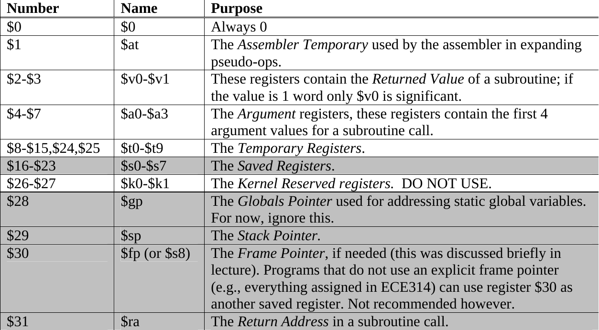
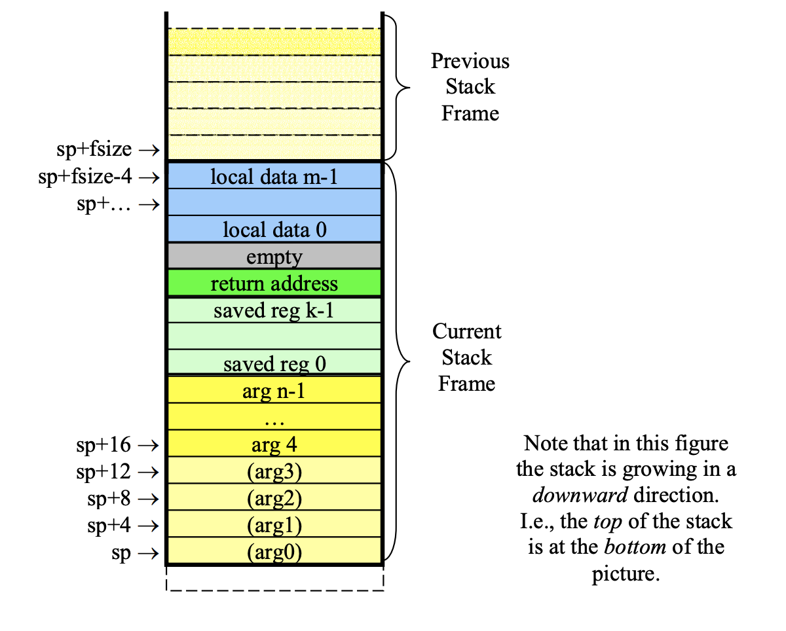
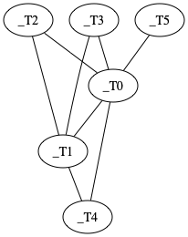
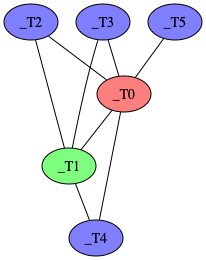

# PA5

目标代码生成

**注意：本阶段为选做。**

## 任务概述

PA1 到 PA3 完成了 Decaf 编译器的前端，⽽ PA4 包含了处于中后端的数据流分析。数据流分析的结果是，我们知道了每个基本块，以及每个 TAC 的 liveOut，liveIn，liveUse，def 集合。之后在具体的后端中，我们会根据中端得到的信息，将 TAC ⼀步⼀步变成底层代码。在具体的后端中我们会将 TAC 中的指令替换成⽬标 ISA 的具体指令，并且将 TAC 中的中间变量变成寄存器或⽴即数等，至此这个简单的编译器就完成了其所有的阶段。本阶段实验的主要任务，是对 TAC 中的中间变量进行**寄存器分配**。

## 实验内容

本次 PA Rust 版本的实验内容与 Java、Scala 版本的略有不同，**请选择 Rust 框架的同学以 [这个](https://mashplant.gitbook.io/decaf-doc/pa5) 实验指导书为准**(选 Java 和 Scala 框架的同学也可作为参考)。不过对于**实验评分和实验报告**这一节的要求还是一样的。

在 PA5 中，我们将完成 Decaf 编译器的寄存器分配功能。寄存器分配的⽬的是，将 TAC 中的临时变量⽆冲突地，⾼效地映射到物理寄存器。我们给出了⼀个贪⼼分配寄存器的⽅法，它是 PA4 的后端采⽤的⽅案。同学们需要实现的是**基于图着⾊的全局寄存器分配⽅法**。在框架中已经有⼀个简单的 MIPS 后端，它会和寄存器分配⼀起，将 TAC 变成最终的 MIPS 汇编。

Java、Scala 版本的实验中，同学们可实现没有 **spill** (溢出)的简化版本中干涉图的构建，即假设寄存器总是够用的，不需要溢出到栈上。当然若你能实现完整的基于⼲涉图着色的寄存器分配算法，那是再好不过的。第⼗⼆讲课堂讲稿以及本实验指导书的末尾给出了图着⾊寄存器分配的算法的具体流程，同学们也可⾃⾏参考⻰书和虎书。

要求同学们实现的寄存器分配算法能够正确⼯作，⽣成的代码能够被 SPIM 执⾏。简化的算法⾯对复杂的输⼊可能失败，但你的实现⾄少要保证能通过 PA4 的所有测试⽤例(公开部分在 https://github.com/decaf-lang/decaf-2019-TestCases/tree/master/S4)。

PA5 和 PA4 ⼀样，没有包含本学期新增语⾔特性，我们允许你直接基于原始框架，即 https://github.com/decaf-lang 上托管的三个语言版本的框架，来完成本次实验。作为例外，如果你之前就是使用完整框架开发，那么建议你直接在它之上添加新代码，以省下代码合并的时间。

> 提示：在 Java 和 Scala 版本的框架中，寄存器分配算法的基类是 `RegAlloc`，目前已有一个 `BruteRegAlloc` 类继承于它，其中实现了基于贪心的寄存器分配算法。你需要参考 `BruteRegAlloc` 再新建一个 `RegAlloc` 的子类，例如名为 `GraphColorRegAlloc`，在其 `accept()` 方法中，使用基于⼲涉图着色的全局寄存器分配算法实现对一个函数的寄存器分配。此外，你可能还需对干涉图也新建一个类，在其中实现着色算法。
>
> 为了让框架使用你自己实现的寄存器分配算法，你还需修改 `src/main/java/decaf/driver/TaskFactory.java`，将 `mips()` 方法中的 `BruteRegAlloc` 替换为你的类名。

## 实验评分和实验报告

实验评分分两部分：

- 正确性：80%。你提交的代码应当能够通过 PA4 的所有[公开测例](https://github.com/decaf-lang/decaf-2019-TestCases/tree/master/S4)与隐藏测例。我们还会检查你的代码是否正确实现了要求，因为什么都不改也能过所有测例。

- 实验报告（根目录下 `report-PA5.pdf` 文件）：20%。要求包含以下内容：

    1. 描述你实现的算法的基本流程。
    2. 如何确定干涉图的节点？连边的条件是什么？
    3. 结合实际的程序(decaf 或 TAC 程序)，比较你实现的算法与原来的贪心算法的寄存器分配结果。只从这个例子来看，两种算法哪个效果更好？

注意：由于 PA5 为选做任务，本阶段**既不**安排 pretest，**也不**接受任何形式的补交。请在截止日期前（见网络学堂作业栏）把代码和文档放到自己的 git.tsinghua 仓库中的 master 分支，并将你认为可以用来评测的最终版本的 commit ID 于截止日期前提交至网络学堂作业栏。

**未在网络学堂作业栏提交 commit ID 的，或提交的 commit ID 晚于截止日期的，一律不会被检查，并视为放弃本次 PA**。

## 相关知识（选读）

### 编译器后端

一个典型的编译器后端依次分为以下三个步骤：

1. 指令选择(instruction selection)，为中间代码选择合适的汇编指令，这一阶段的汇编指令中仍然使用类似中间代码的虚拟寄存器；
2. 指令调度(instruction scheduling)，通过恰当地安排指令的顺序，发掘流水线等硬件并行性的加速效果，减少访存的延迟的影响，充分利用分支延迟槽等；
3. 寄存器分配(register allocation)，为汇编指令中涉及到的虚拟寄存器分配实际的寄存器，同时将无法分配的部分 spill (溢出)到栈上。

可以看出第二步对于我们这个简单的编译器其实不是必要的，我们就不实现这个部分了(我们没有考虑 mips 的分支延迟槽，spim 模拟器的默认选项下这个功能也是关闭的)。

实验框架已经提供了指令选择，实现的很简单，基本上属于简单的 macro expansion[1] 方法，把每条 TAC 指令⽤⼀系列 MIPS 指令机械地替换。不过在 mips 这种 risc 指令集下，指令选择的空间不是很大，因此效果也不会和精心选择的结果相比差太多(相比于 x86 而言)。在很多框架如 LLVM 中，指令选择使⽤的是 tree rewriting 算法 (LLVM 使⽤类似的 DAG rewriting)，并且在寄存器分配之前进⾏。基本思想是将 TAC 指令变成表达式树，将树分成很多块⼦树，每个⼦树对应⼀条指令。 Tree rewriting 和我们实验相关性不⼤，所以略过对这个算法的详细介绍，有兴趣的同学可以参考⻰书或虎书。

### 寄存器分配

理想的寄存器分配结果应当是所有的变量都有合适的寄存器跟它相对应，而且在程序执行过程中的任何时刻，不会出现寄存器分配冲突（即两个同时有效的变量分配到同一个寄存器，特别是同一条指令中用到的两个变量分配到同一个寄存器）。事实上，理想寄存器分配问题是 NP 完全的（可归约成 3-SAT 问题），这意味着对于一个含有几百个变量的程序，为了获得理想的寄存器分配方案，编译器需要消耗大量的时间来进行运算。因此，实际的编译器中均只追求获得该问题的近似最优解。

一般编译器中的寄存器分配方法可分为两类，一类是全局寄存器分配，另一类是局部寄存器分配。全局寄存器分配是指分配寄存器的时候把控制流图中所有的基本块一起考虑，局部寄存器分配是对每个基本块分配进行寄存器分配。

全局寄存器分配通常采用图着色算法，其基本思想是以一个变量作为图的一个结点，如果两个变量需要同时参与同一条指令的运算的话，则这两个变量对应的结点之间连一条边。这样我们便获得所谓的干涉图（interference graph）。然后全局寄存器分配的问题便转化为“如何采用 K 种颜色对干涉图的结点着色，使得相邻的结点总着以不同颜色”的问题，其中 K 是实际机器中的通用寄存器数量，可以采用例如模拟退火、遗传算法等优化方法来解决。但是实际使用中，为了图着色算法更加高效起见，通常不使用单一的变量作为干涉图的一个结点，而是用一系列相交的 DU 链（定值—引用链）构成的同色网（web）作为一个结点来构造干涉图。另外，只采用 K 种颜色来着色通常是不可能的，此时往往是先求一种着色方案，使得所用的颜色数最少，然后选择保存到内存的代价最小的那些变量来保存到内存（从而该结点可以着以一种特殊的颜色）。

目前的框架中，Decaf 采用一种很简单的局部寄存器分配策略，在基本块开头，把 liveIn 的变量 load 进寄存器，基本块内为变量分配寄存器，在离开基本块时，将 liveOut 的变量 store 出去。局部寄存器分配是对每个基本块分别进行寄存器分配的方法。

局部寄存器分配的实现有多种，在 Decaf 编译器中采用了一种基于活性分析结果的做法，其基本思想是：从头到尾扫描基本块中的指令；对于每条指令的源操作数，我们查看是否已经放在寄存器里面，如果不是则分配一个寄存器并从栈帧中把该变量加载进寄存器中；对于每条指令的目标操作数，如果还没有跟某个寄存器关联，则我们分配一个新的寄存器给它。当分配寄存器的时候，我们首先看看有没有寄存器尚未跟某个变量关联，有则选择该寄存器作为分配结果，否则看看有没有寄存器所关联的变量在当前已经不是活跃变量了，有则选择该寄存器作为分配结果，否则说明当前所有寄存器所关联的变量都是活跃的，则需要把某个寄存器所关联的现在暂时 不用的变量“扔”到栈帧（内存的一部分）中，从而腾出这个寄存器。

### 调用约定

比较详细的调用约定(calling convention)参见[2]。与寄存器相关的调用约定如下：



其中灰色的寄存器为被调用者保存的寄存器(callee-saved)，白色的为调用者保存的寄存器(caller-saved)。值得注意的是，虽然 $ra 由被调用者保存，它的值也的确在进入和离开被调用的函数时保持一致，但是函数调用指令本身会修改它。

在 Java 和 Scala 版本的框架中，寄存器分配的范围限制在 $v1，$t0~$t9，$s0~$s8 这 20 个寄存器，其他一些寄存器例如 $ra，$v0，$a0~$a3 都有自己特殊的用途，为了简单起见它们不参与寄存器的分配。在Rust版本的框架中，寄存器分配的范围是刚才提到的所有26个寄存器，$ra，$v0，$a0~$a3这些虽然有特殊的用途，但是也可以参与一般的分配。

对于被调用者保存的寄存器，会在函数的 prologue 部分将它们保存到栈上，而在 epilogue 部分生成代码将它们恢复(只需要保存和恢复实际参与分配的那些)。对于 Java 和 Scala 版本，在 prologue 阶段还会将所有函数参数也保存到栈上，因为 $a0~$a3 不参与寄存器分配，而在该函数内调用其他函数时需要使用这些寄存器进行传参。

```assembly
foo:
  ...
  sw $s0, _offset0($sp)
  sw $s1, _offset1($sp)
  ...
  sw $s7, _offset7($sp)
  sw $ra, _offset8($sp)

  ... # 函数体，所有的返回都翻译为到 epilogue 的跳转

foo_exit:
  lw $s0, _offset0($sp)
  lw $s1, _offset1($sp)
  ...
  lw $s7, _offset7($sp)
  lw $ra, _offset8($sp)
  ...
  jr $ra # 返回
```

对于调用者保存寄存器，会在每次处理 `IndirectCall` 和 `DirectCal` 时，在实际跳转指令前后插入伪指令，进行寄存器的保存与恢复。而具体要保存和恢复哪些寄存器取决于跳转指令处活跃变量所分配的寄存器。在 Java 和 Scala 版本的框架中，这一步也需要在寄存器分配时完成。

### 栈帧

这里所说的栈帧(stack frame)是我们在 PA3 文档中提到的运行时存储布局的相关内容。栈帧是分配在栈上的内存区域，Decaf 中的栈帧如图所示：



栈帧可以分为下面几个区域：

1. 参数区域。MIPS 使用 $a0~$a3 这四个寄存器传递参数，如果在一个函数中调用了另一个函数，就需要把原来的 $a0~$a3 都保存到栈帧上。此外，如果一个函数使用了多余 4 个参数，调用它时多出来的参数会被依次保存到 $sp+16, $sp+20... 这些位置。

2. 保存的寄存器区域。这块区域用于保存 callee-saved 寄存器 ($s0~$s8)，如果它们会在这个函数里被用到。

3. 返回地址。如果在一个函数中调用了另一个函数，$ra 就会被修改，于是也需要进行保存。有时为了让 $ra 保存的地址 8 字节对齐，可能会在其前面插入一些空，不过这在 Decaf 程序中没有使用。

4. 局部数据。用于存放局部变量，即那些无法满足寄存器分配要求而被 spill 到栈上的数据。

栈帧是函数运行所需要的上下文的一部分，在进入函数的时候需要建立自己的栈帧，在退出函数的时候需要销毁自己所建立的栈帧。对于有些程序，栈帧的大小不确定，因此建立栈帧的时候需要把旧的栈帧首地址(存在 $fp 中)也保存到栈上，然后用 $fp 保存旧栈帧的尾地址(存在 $sp 中)，并适当修改 $sp 寄存器的内容让它指向新栈帧的尾地址。可见，每个栈帧在栈上是头尾相接的，它们把栈区分为一个一个的窗口(frame)，这正是“栈帧”(stack-frame)这个名字的来源。

在 Decaf 中，由于栈桢的大小在编译期的时候是可以计算出来的，因此 $fp 实际上是不需要的，因为移动和恢复 $sp 的时候，可以简单的通过加减立即数来做到，并不需要事先保存。在实际的编译器里，在栈大小小于 65536 个字节，并且没有 alloca 之类会动态分配栈空间的操作时，也是不会使用 $fp 的。所以我们把 $fp (即 $s8) 也当做可分配的通用寄存器。

### 基于⼲涉图着色的全局寄存器分配

#### 前置知识: 数据流分析

你应当懂得 $$liveUse$$，$$liveIn$$ 等集合的含义，并且理解下⾯⽅程的含义：

$$
\begin{aligned}
liveIn(bb) &= liveUse(bb) \cup (liveOut(bb) - def(bb)) \\
liveOut(bb) &= \bigcup_{bb'~\mathrm{is~successor~of}~bb}liveIn(bb')
\end{aligned}
$$

并且你能将这个方程扩展到 tac 上，计算出 $$def(tac)$$，$$liveOut(tac)$$ 等。

#### 构建干涉图

基于⼲涉图着色寄存器分配的基本步骤是：

1. 从数据流分析的结果，构建函数的⼲涉图；
2. 对干涉图着色；
3. 根据着色结果，确定 Temp 分配到哪个寄存器，还是 spill 到内存。

⼲涉图是⼀个⽆向图 $$G$$，节点是 Temp (⼀种理解是将 Temp 认为是⽆穷多的虚拟寄存器)。不过，根据调用约定，有些 Temp 被分配为什么寄存器是确定的，例如 MIPS 中函数返回值保存在 $v0，函数参数通过 $a0~$a3 传递，可认为这些节点已经被**预着色**了，建图时无需考虑它们。

节点 $$u,v$$ 之间有边说明 Temp $$u$$ 和 Temp $$v$$ 不能被分配到同一寄存器中。⽽连边的准则，⻰书中是：

> [f]or each procedure a register-interference graph is constructed in which the nodes are symbolic registers and an edge connects two nodes if one is live at a point where the other is defined.

到 PA5 中，procedure 即函数，区别于局部寄存器分配算法，全局寄存器分配可能会跨越多个基本块，你需要把所谓的 "is live" 和 "defined" ⾃⼰定义清楚。

如果⼀种颜⾊代表⼀个寄存器，那么对于有 $$k$$ 个通⽤寄存器的 ISA 来说，这个图能被 $$k$$ 着⾊就说明其中所有 Temp 可以被分配到物理寄存器⽽不⽤ spill。⽽如果不能 $$k$$ 着⾊，说明其中有些 Temp 需要被 spill 到内存，删除这些 Temp 对应的结点，直到删除结点后的新图可以被 $$k$$ 着⾊。当然，在本次实验的这个简化版本的图着色算法中，你不需要考虑 spill，即假设寄存器都是够用的。在这种情况下，除了函数的 prologue、epilogue 部分，以及跳转指令前后的 caller-saved 寄存器保存和恢复部分外，都不需要访问栈内存来保存或恢复寄存器。

#### 干涉图着色

“一个图是否能用 $$k$$ 种颜色着色”是一个 NP-完全问题。以下是一个简单的启发式 $$k$$-着色算法思想：

1. 假设图 $$G$$ 中某个结点 $$n$$ 的度数小于 $$k$$，从 $$G$$ 中删除 $$n$$ 及其邻边得到图 $$G'$$，对 $$G$$ 的 $$k$$-着色问题可转化为先对 $$G'$$ 进行 $$k$$-着色，然后给结点 $$n$$ 分配一个其相邻结点在 $$G'$$ 的 $$k$$-着色中 没有使用过的颜色。

2. 重复 1 的过程从图中删除度数小于 $$k$$ 的结点。如果可以到达一个空图，说明对原图可以成功实现 $$k$$-着色；否则，原图不能成功实现 $$k$$-着色，可从 $$G$$ 中选择某个结点(作为泄露候选)将其删除，算法可继续。

#### 一个例子

下⾯给出⼀个例⼦。辗转相除的 decaf 代码是：

```java
static int gcd(int a, int b) {
    while (a != 0) {
        int c;
        c = b % a;
        b = a;
        a = c;
    }
    return b;
}
```

经过数据流分析与指令选择后，变成：

```
FUNCTION<Main.gcd>:
BLOCK 1 (_L2)
    def     = [_T2, _T3]
    liveUse = [_T0]
    liveIn  = [_T0, _T1]
    liveOut = [_T0, _T1]

    li      _T2, 0 # liveOut = [_T0, _T1, _T2]
    sne     _T3, _T0, _T2 # liveOut = [_T0, _T1, _T3]
    beqz    _T3, _L1 # liveOut = [_T0, _T1]

BLOCK 2
    def     = [_T0, _T1, _T4, _T5]
    liveUse = [_T0, _T1]
    liveIn  = [_T0, _T1]
    liveOut = [_T0, _T1]

    rem     _T5, _T1, _T0 # liveOut = [_T0, _T5]
    move    _T4, _T5 # liveOut = [_T0, _T4]
    move    _T1, _T0 # liveOut = [_T1, _T4]
    move    _T0, _T4 # liveOut = [_T0, _T1]
    j       _L2 # liveOut = [_T0, _T1]

BLOCK 3 (_L1)
    def     = [$v0]
    liveUse = [_T1]
    liveIn  = [_T1]
    liveOut = []

    move    $v0, _T1 # liveOut = []
    j       _L_Main_gcd_exit # liveOut = []
```

构建⼲涉图如下：



⼀个着色⽅案如：



红⾊对应 $t0，绿⾊对应 $t1，蓝⾊对应 $t2，则完成寄存器分配如：

```
FUNCTION<Main.gcd>:
BLOCK 1 (_L2)
    li      $t2, 0
    sne     $t2, $t0, $t2
    beqz    $t2, _L1

BLOCK 2
    rem     $t2, $t1, $t0
    move    $t2, $t2
    move    $t1, $t0
    move    $t0, $t2
    j       _L2

BLOCK 3 (_L1)
    move    $v0, $t1
    j       _L_Main_gcd_exit
```

容易看出，这个寄存器分配是正确的。但是，也容易发现有一条指令 `move $t2, $t2` 是多余的。为了简单起见，你不需要处理这种情况，感兴趣的同学可以参考 Rust 版本文档的 [干涉图节点合并](https://mashplant.gitbook.io/decaf-doc/pa5/gan-she-tu-jie-dian-he-bing) 一节进行优化。


### 参考文献

1. Gabriel Hjort Blindell. Instruction Selection: Principles, Methods, and Applications. Springer International Publishing, 2016.

2. [MIPS Calling Convention](https://courses.cs.washington.edu/courses/cse410/09sp/examples/MIPSCallingConventionsSummary.pdf)
